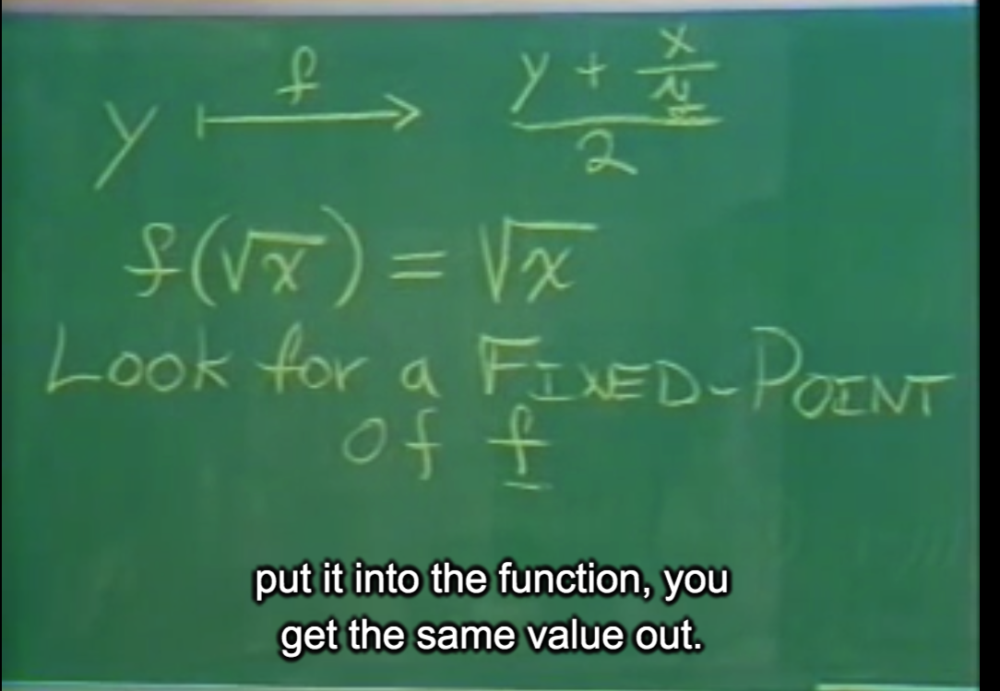

PROFESSOR: Well, yesterday was easy. You learned all of the rules of programming and lived.Almost all of them. And so at this point, you're now certified programmers-- it says. However, I suppose what we did is we, aah, sort of got you a little bit of into an easy state. Here, you still believe it's possible that this might be programming in BASIC or Pascal with just a funny syntax.Today, that illusion-- or you can no longer support that belief. What we're going to do today isgoing to completely smash that.

So let's start out by writing a few programs on the blackboard that have a lot in common with each other. What we're going to do is try to make them abstractions that are not ones that are easy to make in most languages. Let's start with some very simple ones that you can make inmost languages.

Supposing I want to write the mathematical expression which adds up a bunch of integers. So if Iwanted to write down and say the sum from i equal a to b on i. Now, you know that that's aneasy thing to compute in a closed form for it, and I'm not interested in that. But I'm going to write a program that adds up those integers.

Well, that's rather easy to do to say I want to define the sum of the integers from a to b to be--well, it's the following two possibilities. If a is greater than b, well, then there's nothing to be doneand the answer is zero. This is how you're going to have to think recursively. You're going to sayif I have an easy case that I know the answer to, just write it down. Otherwise, I'm going to try toreduce this problem to a simpler problem. And maybe in this case, I'm going to make a subproblem of the simpler problem and then do something to the result. So the easiest way to dothis is say that I'm going to add the index, which in this case is a, to the result of adding up theintegers from a plus 1 to b.

Now, at this point, you should have no trouble looking at such a definition. Indeed, coming upwith such a thing might be a little hard in synthesis, but being able to read it at this point shouldbe easy. And what it says to you is, well, here is the subproblem I'm going to solve. I'm going totry to add up the integers, one fewer integer than I added up for the the whole problem. I'madding up the one fewer one, and that subproblem, once I've solved it, I'm going to add a to that,and that will be the answer to this problem. And the simplest case, I don't have to do any work.

Now, I'm also going to write down another simple one just like this, which is the mathematicalexpression, the sum of the square from i equal a to b. And again, it's a very simple program. Andindeed, it starts the same way. If a is greater than b, then the answer is zero. And, of course,we're beginning to see that there's something wrong with me writing this down again. It's thesame program. It's the sum of the square of a and the sum of the square of the increment and b.

Now, if you look at these things, these programs are almost identical. There's not much todistinguish them. They have the same first clause of the conditional and the same predicate andthe same consequence, and the alternatives are very similar, too. They only differ by the fact thatwhere here I have a, here, I have the square of a. The only other difference, but this one's sort ofunessential is in the name of this procedure is sum int, whereas the name of the procedure issum square. So the things that vary between these two are very small.

Now, wherever you see yourself writing the same thing down more than once, there's somethingwrong, and you shouldn't be doing it. And the reason is not because it's a waste of time to writesomething down more than once. It's because there's some idea here, a very simple idea, whichhas to do with the sigma notation-- this much-- not depending upon what it is I'm adding up. AndI would like to be able to-- always, whenever trying to make complicated systems andunderstand them, it's crucial to divide the things up into as many pieces as I can, each of which Iunderstand separately. I would like to understand the way of adding things up independently ofwhat it is I'm adding up so I can do that having debugged it once and understood it once andhaving been able to share that among many different uses of it.

Here, we have another example. This is Leibnitz's formula for finding pi over 8. It's a funny, uglymess. What is it? It's something like 1 over 1 times 3 plus 1 over 5 times 7 plus 1 over 9 times 11plus-- and for some reason, things like this tend to have interesting values like pi over 8. Butwhat do we see here? It's the same program or almost the same program. It's a sum. So we'reseeing the figure notation, although over here, we're dealing with incrementing by 4, so it's aslightly different problem, which means that over here, I have to change a by 4, as you see rightover here. It's not by 1.

The other thing, of course, is that the thing that's represented by square in the previous sum ofsquares, or a when adding up the integers. Well, here, I have a different thing I'm adding up, adifferent term, which is 1 over a times a plus 2. But the rest of this program is identical. Well, any time we have a bunch of things like this that are identical, we're going to have to come up withsome sort of abstraction to cover them.

If you think about this, what you've learned so far is the rules of some language, some primitive,some means of combination, almost all of them, the means of abstraction, almost all of them.But what you haven't learned is common patterns of usage.

Now, most of the time, you learn idioms when learning a language, which is a common patternthat mean things that are useful to know in a flash. And if you build a great number of them, ifyou're a FORTRAN programmer, of course, everybody knows how to-- what do you do, forexample, to get an integer which is the biggest integer in something. It's a classic thing. EveryFORTRAN programmer knows how to do that. And if you don't know that, you're in real hotwater because it takes a long time to think it out. However, one of the things you can do in this language that we're showing you is not only do you know something like that, but you give the knowledge of that a name. And so that's what we're going to be going after right now.

OK, well, let's see what these things have in common. Right over here we have what appears tobe a general pattern, a general pattern which covers all of the cases we've seen so far. There isa sum procedure, which is being defined. It has two arguments, which are a lower bound and anupper bound. The lower bound is tested to be greater than the upper bound, and if it is greater,then the result is zero. Otherwise, we're going to do something to the lower bound, which is theindex of the conversation, and add that result to the result of following the procedure recursivelyon our lower bound incremented by some next operation with the same upper bound as I hadbefore.

So this is a general pattern, and what I'd like to do is be able to name this general pattern a bit.Well, that's sort of easy, because one of the things I'm going to do right now is-- there's nothingvery special about numbers. Numbers are just one kind of data. It seems to me perfectlyreasonable to give all sorts of names to all kinds of data, for example, procedures. And nowmany languages allow you have procedural arguments, and right now, we're going to talk aboutprocedural arguments. They're very easy to deal with. And shortly, we'll do some remarkablethings that are not like procedural arguments.

So here, we'll define our sigma notation. This is called sum and it takes a term, an A, a nextterm, and B as arguments. So it takes four arguments, and there was nothing particularly specialabout me writing this in lowercase. I hope that it doesn't confuse you, so I'll write it in uppercaseright now. The machine doesn't care.

But these two arguments are different. These are not numbers. These are going to beprocedures for computing something given a number. Term will be a procedure which, whengiven an index, will produce the value of the term for that index. Next will be given an index, which will produce the next index. This will be for counting. And it's very simple. It's exactly whatyou see. If A is greater than B, then the result is 0. Otherwise, it's the sum of term applied to Aand the sum of term, next index.

Let me write it this way. Now, I'd like you to see something, first of all. I was writing here, and Iran out of space. What I did is I start indenting according to the Pretty-printing rule, which saysthat I align all of the arguments of the procedure so I can see which ones go together. And this isjust something I do automatically, and I want you to learn how to do that, too, so your programscan be read and understood.

However, what do we have here? We have four arguments: the procedure, the lower index--lower bound index-- the way to get the next index, and the upper bound. What's passed along onthe recursive call is indeed the same procedure because I'm going to need it again, the nextindex, which is using the next procedure to compute it, the procedure for computing next, which Ialso have to have separately, and that's different. The procedure for computing next is differentfrom the next index, which is the result of using next on the last index. And I also have to passalong the upper bound. So this captures both of these and the other nice program that we areplaying with.

So using this, we can write down the original program as instances of sum very simply. A and B.Well, I'm going to need an identity procedure here because ,ahh, the sum of the integersrequires me to in this case compute a term for every integer, but the term procedure doesn'twant to do anything to that integer. So the identity procedure on A is A or X or whatever, and Iwant to say the sum of using identity of the term procedure and using A as the initial index andthe incrementer being the way to get the next index and B being the high bound, the upper bound. This procedure does exactly the same as the sum of the integers over here, computesthe same answer.

Now, one thing you should see, of course, is that there's nothing very special over here aboutwhat I used as the formal parameter. I could have, for example, written this X. It doesn't matter. Ijust wanted you to see that this name does not conflict with this one at all. It's an internal name.

For the second procedure here, the sum of the squares, it's even a little bit easier. And what dowe have to do? Nothing more than add up the squares, this is the procedure that each index willbe given, will be given each-- yes. Each index will have this done to it to get the term. That's thething that maps against term over here. Then I have A as the lower bound, the incrementer asthe next term method, and B as the upper bound.

And finally, just for the thing that we did about pi sums, pi sums are sort of-- well, it's even easierto think about them this way because I don't have to think. What I'm doing is separating the thingI'm adding up from the method of doing the addition. And so we have here, for example, pi sumA B of the sum of things. I'm going to write the terms procedure here explicitly without giving it aname. This is done anonymously. I don't necessarily have to give a name to something if I just want to use it once.

And, of course, I can write sort of a expression that produces a procedure. I'm going to write theGreek lambda letter here instead of L-A-M-B-D-A in general to avoid taking up a lot of space onblackboards. But unfortunately, we don't have lambda keys on our keyboards. Maybe we canconvince our friends in the computer industry that this is an important. Lambda of i is the quotientof 1 and the product of i and the sum of i 2, starting at a with the way of incrementing being thatprocedure of an index i, which adds i to 4, and b being the upper bound. So you can see that this notation, the invention of the procedure that takes a procedural argument, allows us to compressa lot of these procedures into one thing. This procedure, sums, covers a whole bunch of ideas.

Now, just why is this important? I tried to say before that it helps us divide a problem into two pieces, and indeed, it does, for example, if someone came up with a different way ofimplementing this, which, of course, one might. Here, for example, an iterative implementation of sum. **Iterative implementation for some reason might be better than the recursive implementation**. But the important thing is that it's different.

Now, supposing I had written my program this way that you see on the blackboard on the left.That's correct, the left. Well, then if I want to change the method of addition, then I'd have to change each of these. Whereas if I write them like this that you see here, then the method by which I did the addition is encapsulated in the procedure sum. That decomposition allows me to independently change one part of the program and prove it perhaps without changing the other part that was written for some of the other cases. Thank you. Are there any questions? Yes, sir.

AUDIENCE: Would you go over next A and next again on--

PROFESSOR: Yes. It's the same problem. I'm sure you're going to-- you're going to have towork on this. This is hard the first time you've ever seen something like this.

What I have here is a-- procedures can be named by variables. Procedures are not special.Actually, sum square is a variable, which has gotten a value, which is a procedure. This is definesum square to be lambda of A and B something. So the procedure can be named. Therefore,they can be passed from one to another, one procedure to another, as arguments. Well, what we're doing here is we're passing the procedure term as an argument to sum just when we get it around in the **next recursive**.

Here, we're passing the procedure next as an argument also. However, here we're using the procedure next. That's what the parentheses mean. We're applying next to A to get the next value of A. If you look at what next is mapped against, remember that the way you think about this is that you substitute the arguments for the formal parameters in the body. If you're ever confused, think of the thing that way.

Well, over here, with sum of the integers. I substitute identity for a term and 1 plus the incrementer for next in the body. Well, the identity procedure on A is what I get here. Identity is being passed along, and here, I have increment 1 plus being applied to A and 1 plus is being passed along. Does that clarify the situation?

AUDIENCE: We could also define explicitly those two functions, then pass them.

PROFESSOR: Sure. What we can do is we could have given names to them, just like I did here.In fact, I gave you various ways so you could see it, a variety. Here, I define the thing which Ipassed the name of. I referenced it by its name. But the thing is, in fact, that procedure, one argument X, which is X. And the identity procedure is just lambda of X X. And that's what you're seeing here. Here, I happened to just write its canonical name there for you to see. Is it OK if we take our five-minute break?

---

22:42

As I said, computers to make people happy, not people to make computers happy. And for themost part, the reason why we introduce all this abstraction stuff is to make it so that programs can be more easily written and more easily read. Let's try to understand what's the most complicated program we've seen so far using a little bit of this abstraction stuff.

If you look at the slide, this is the Heron of Alexandria's method of computing square roots that we saw yesterday. And let's see. Well, in any case, this program is a little complicated. And at the current state of your thinking, you just can't look at that and say, oh, this obviously means something very clear. It's not obvious from looking at the program what it's computing. There's some loop here inside try, and a loop does something about trying the improvement of y. There's something called improve, which does some averaging and quotienting and things like that. But what's the real idea? Can we make it clear what the idea is? Well, I think we can. I think we can use abstraction that we have learned about so far to clarify what's going on.

Now, what we have mathematically is a procedure for improving a guess for square roots. And if y is a guess for a square root, then what we want to get we'll call a function f. This is the means of improvement. I want to get y plus x/y over 2, so the average of y and x divided by y as the improved value for the square root of x such that-- one thing you can notice about this function fis that f of the square root of f is in fact the square root of x. In other words, if I take the square root of x and substitute it for y here, I see the square root of x plus x divided by the square of x,which is the square root of x. That's 2 times the square root of x divided by 2, is the square root of x.

---

25:30

### 不动点

So, in fact, what we're really looking for is we're looking for a **fixed point**, a fixed point of thefunction f. A fixed point is a place which has the property that if you put it into the function, you get the same value out. Now, I suppose if I were giving some nice, boring lecture, and you happened to have in front of you an HP-35 desk calculator like I used to have when I went to boring lectures. And if you think it was really boring, you put it into radians mode, and you hit cosine, and you hit cosine, and you hit cosine. And eventually, you end up with 0.734 or something like that. 0.743, I don't remember what exactly, and it gets closer and closer to that.Some functions have the property that you can find their **fixed point** by iterating the function, and that's essentially what's happening in the square root program by Heron's method.

So let's see if we can write that down, that idea. Now, I'm not going to say how I compute fixed points yet. There might be more than one way. But the first thing to do is I'm going to say what I just said. I'm going to say it specifically, the square root. The square root of x is the fixed point of that procedure which takes an argument y and averages of x divided by y with y. And we're going to start up with the initial guess for the fixed point of 1. It doesn't matter where it starts. A theorem having to do with square roots.

So what you're seeing here is I'm just trying to write out by wishful thinking. I don't know how I'm going to make fixed point happen. We'll worry about that later. But if somehow I had a way of finding the fixed point of the function computed by this procedure, then I would have-- that would be the square root that I'm looking for.

OK, well, now let's see how we're going to write-- how we're going to come up with fixed points.Well, it's very simple, actually. I'm going to write an abbreviated version here just so we understand it. I'm going to find the fixed point of a function f-- actually, the fixed point of the function computed by the procedure whose name will be f in this procedure. How's that? A longsentence-- starting with a particular starting value.

Well, I'm going to have a little loop inside here, which is going to push the button on thecalculator repeatedly, hoping that it will eventually converge. And we will say here internal loopsare written by defining internal procedures. Well, one thing I'm going to have to do is I'm going tohave to say whether I'm done. And the way I'm going to decide when I'm done is when the oldvalue and the new value are close enough so I can't distinguish them anymore. That's thestandard thing you do on the calculator unless you look at more precision, and eventually, yourun out of precision.

So the old value and new value, and I'm going to stay here if I can't distinguish them if they'reclose enough, and we'll have to worry about what that is soon. The old value and the new value are close enough to each other and let's pick the new value as the answer. Otherwise, I'm goingto iterate around again with the next value of old being the current value of new and the nextvalue of new being the result of calling f on new. And so this is my iteration loop that pushes thebutton on the calculator. I basically think of it as having two registers on the calculator: old andnew. And in each step, new becomes old, and new gets F of new. So this is the thing where I'mgetting the next value.

---

31:56 (屏幕展示求不动点)

And now, I'm going to start this thing up by giving two values. I wrote down on the blackboard tobe slow so you can see this. This is the first time you've seen something quite this complicated, I think. However, we might want to see the whole thing over here in this transparency or slide or whatever. What we have is all of the details that are required to make this thing work. I have away of getting a tolerance for a close enough procedure, which we see here. The close enough procedure, it tests whether u and v are close enough by seeing if the absolute value of the difference in u and v is less than the given tolerance, OK? And here is the iteration loop that Ijust wrote on the blackboard and the initialization for it, which is right there. It's very simple.

But let's see. I haven't told you enough. It's actually easier than this. There is more structure tothis problem than I've already told you. Like why should this work? Why should it converge?There's a hairy theorem in mathematics tied up in what I've written here. Why is it that I shouldassume that by iterating averaging the quotient of x and y and y that I should get the rightanswer? It isn't so obvious.

Surely there are other things, other procedures, which compute functions whose fixed points would also be the square root. For example, the obvious one will be a new function g, which maps y to x/y. That's even simpler. The fixed point of g is surely the square root also, and it's asimpler procedure.

Why am I not using it? Well, I suppose you know. Supposing x is 2 and I start out with 1, and if Idivide 1 into 2, I get 2. And then if I divide 2 into 2, I get 1. If I divide 1 into 2, I get 2, and 2 into 2,I get 1, and I never get any closer to the square root. It just oscillates. So what we have is asignal processing system, an electrical circuit which is oscillating, and I want to damp out theseoscillations. Well, I can do that.

See, what I'm really doing here when I'm taking my average, the average is averaging the last two values of something which oscillates, getting something in between. The classic way is damping out oscillations in a signal processing system. So why don't we write down the strategythat I just said in a more clear way? Well, that's easy enough.

I'm going to define the square root of x to be a fixed point of the procedure resulting from average damping. So I have a procedure resulting from average damp of the procedure, thatprocedure of y, which divides x by y starting out at 1. Ah, but average damp is a special procedure that's going to take a procedure as its argument and return a procedure as its value.It's a generalization that says given a procedure, it's the thing which produces a procedure whichaverages the last value and the value before and after running the procedure. You can use it foranything if you want to damp out oscillations. So let's write that down. It's very easy.

And stylistically here, I'm going to use lambda notation because it's much easier to think whenyou're dealing with procedure, the mid-line procedures, to understand that the procedures arethe objects I'm dealing with, so I'm going to use lambda notation here. Not always. I don't alwaysuse it, but very specifically here to expand on that idea, to elucidate it.

Well, average damp is a procedure, which takes a procedure as its argument, which we will callf. And what does it produce? It produces as its value-- the body of this procedure is a thing whichproduces a procedure, the construct of the procedures right here, of one argument x, whichaverages f of x with x.

This is a very special thing. I think for the first time you're seeing a procedure which produces aprocedure as its value. This procedure takes the procedure f and does something to it toproduce a new procedure of one argument x, which averages f-- this f-- applied to x and x itself.Using the context here, I apply average damping to the procedure, which just divides x by y. It'sa division. And I'm finding to fixed point of that, and that's a clearer way of writing down what Iwrote down over here, wherever it was. Here, because it tells why I am writing this down.

I suppose this to some extent really clarifies what Heron of Alexandria was up to. I suppose I'llstop now. Are there any questions?

AUDIENCE: So when you define average damp, don't you need to have a variable on f?

PROFESSOR: Ah, the question was, and here we're having-- again, you've got to learn aboutthe syntax. The question was when defining average damp, don't you have to have a variable defined with f? What you are asking about is the formal parameter of f?

AUDIENCE: Yeah.

PROFESSOR: OK. The formal parameter of f is here. The formal parameter of f--

AUDIENCE: The formal parameter of average damp.

PROFESSOR: F is being used to apply it to an argument, right? It's indeed true that f must havea formal parameter. Let's find out what f's formal parameter is.

AUDIENCE: The formal parameter of average damp.

PROFESSOR: Oh, f is the formal parameter of average damp. I'm sorry. You're just confusing a syntactic thing. I could have written this the other way. Actually, I didn't understand your question. Of course, I could have written it this other way. Those are identical notations. This is a different way of writing this. You're going to have to get used to lambda notation because I'm going to use it.

What it says here, I'm defining the name average damp to name the procedure whose of one argument f. That's the formal parameter of the procedure average damp. What define does is it says give this name a value. Here is the value of for it. That there happens to be a funny syntax to make that easier in some cases is purely convenience. But the reason why I wrote it this way here is to emphasize that I'm dealing with a procedure that takes a procedure as its argument and produces a procedure as its value.

AUDIENCE: I don't understand why you use lambda twice. Can you just use one lambda and take two arguments f and x?

PROFESSOR: No.

AUDIENCE: You can't?

PROFESSOR: No, that would be a different thing. If I were to write the procedure lambda of f and x, the average of f of x and x, that would not be something which would be allowed to take aprocedure as an argument and produce a procedure as its value. That would be a thing that takes a procedure as its argument and numbers its argument and produces a new number. But what I'm producing here is a procedure to fit in the procedure slot over here, which is going to be used over here. So the number has to come from here. This is the thing that's going to eventually end up in the x. And if you're confused, you should do some substitution and see foryourself. Yes?

AUDIENCE: Will you please show the definition for average damp without using lambda notationin both cases.

PROFESSOR: I can't make a very simple one like that. Let me do it for you, though. I can get rid of this lambda easily. I don't want to be-- actually, I'm lying to you. I don't want to do what you want because I think it's more confusing than you think. I'm not going to write what you want.

So we'll have to get a name. FOO of x to be of F of x and x and return as a value FOO. This is equivalent, but I've had to make an arbitrary name up. This is equivalent to this without any lambdas. Lambda is very convenient for naming anonymous procedures. It's the anonymous name of something. Now, if you really want to know **a cute way** of doing this, we'll talk about it later. We're going to have to define the anonymous procedure. Any other questions? And so we go for our break again.

---

42:55

So now we've seen how to use high-order procedures, they're called. That's procedures thattake procedural arguments and produce procedural values to help us clarify and abstract someotherwise complicated processes. I suppose what I'd like to do now is have a bit of fun with thatand sort of a little practice as well. So let's play with this square root thing even more. Let'selaborate it and understand what's going on and make use of this kind of programming style.

One thing that you might know is that there is a general method called Newton's method thepurpose of which is to find the roots-- that's the zeroes-- of functions. So, for example, to find a ysuch that f of y equals 0, we start with some guess. This is Newton's method. And the guess westart with we'll call y0, and then we will iterate the following expression.

y n plus 1-- this is a difference equation-- is yn minus f of yn over the derivative with respect to yof f evaluated at y equal yn. Very strange notation. I must say ugh. The derivative of f withrespect to y is a function. I'm having a little bit of unhappiness with that, but that's all right. It turns out in the programming language world, the notation is much clearer.

Now, what is this? People call it Newton's method. It's a method for finding the roots of the function f. And it, of course, sometimes converges, and when it does, it does so very fast. Andsometimes, it doesn't converge, and, oh well, we have to do something else. But let's talk aboutsquare root by Newton's method.

Well, that's rather interesting. Let's do exactly the same thing we did last time: a bit of wishfulthinking. We will apply Newton's method, assuming we knew how to do it. You don't know how todo it yet. Well, let's go. What do I have here? The square root of x. It's Newton's method appliedto a procedure which will represent that function of y, which computes that function of y. Well,that procedure is that procedure of y, which is the difference between x and the square of y.Indeed, if I had a value of y for which this was zero, then y would be the square root of x. Seethat? OK, I'm going to start this out searching at 1. Again, completely arbitrary property of squareroots that I can do that.

Now, how am I going to compute Newton's method? Well, this is the method. I have it right here.In fact, what I'm doing is looking for a fixed point of some procedure. This procedure involvessome complicated expressions in terms of other complicated things. Well, I'm trying to find thefixed point of this. I want to find the values of y, which if I put y in here, I get the same value outhere up to some degree of accuracy. Well, I already have a fixed point process around to dothat. And so, let's just define Newton's method over here.

A procedure which computes a function and a guess, initial guess. Now, I'm going to have to dosomething here. I'm going to need the derivative of the function. I'm going to need a procedurewhich computes the derivative of the function computed by the given a procedure f. I'm trying tobe very careful about what I'm saying. I don't want to mix up the word procedure and function.Function is a mathematical word. It says I'm mapping from values to other values, a set ofordered pairs. But sometimes, I'll accidentally mix those up. Procedures compute functions.

So I'm going to define the derivative of f to be by wishful thinking again. I don't know how I'm going to do it. Let's worry about that later-- of F. So if F is a procedure, which happens to be thisone over here for a square root, then DF will be the derivative of it, which is also the derivative ofthe function computed by that procedure. DF will be a procedure that computes the derivative ofthe function computed by the procedure F. And then given that, I will just go looking for a fixedpoint.

What is the fixed point I'm looking for? It's the one for that procedure of one argument x, which Icompute by subtracting x. That's the old-- that's the yn here. The quotient of f of x and df of x,starting out with the original guess. That's all very simple.

Now, I have one part left that I haven't written, and I want you to see the process by which I writethese things, because this is really true. I start out with some mathematical idea, perhaps. Bywishful thinking, I assume that by some magic I can do something that I have a name for. I'm not going to worry about how I do it yet. Then I go walking down here and say, well, by some magic,I'm somehow going to figure how to do that, but I'm going to write my program anyway. Wishfulthinking, essential to good engineering, and certainly essential to a good computer science.

So anyway, how many of you wished that your computer ran faster? Well, the derivative isn't sobad either. Sort of like average damping. The derivative is a procedure that takes a procedurethat computes a function as its argument, and it produces a procedure that computes a function,which needs one argument x. Well, you all know this definition. It's f of x plus delta x minus f of xover delta x, right? For some small delta x. So that's the quotient of the difference of f of the sumof x and dx minus f point x divided by dx. I think the thing was lining up correctly when I balancedthe parentheses.

Now, I want you to look at this. Just look. I suppose I haven't told you what dx is. Somewhere inthe world I'm going to have to write down something like that. I'm not interested. This is aprocedure which takes a procedure and produces an approximation, a procedure that computesan approximation of the derivative of the function computed by the procedure given by thestandard methods that you all know and love.

Now, it may not be the case that doing this operation is such a good way of approximating aderivative. Numerical analysts here should jump on me and say don't do that. Computingderivatives produces noisy answers, which is true. However, this again is for the sake ofunderstanding. Look what we've got. We started out with what is apparently a mathematicallycomplex thing. and. In a few blackboards full, we managed to decompose the problem ofcomputing square roots by the way you were taught in your college calculus class-- Newton'smethod-- so that it can be understood. It's clear.

Let's look at the structure of what it is we've got. Let's look at this slide. This is a diagram of themachine described by the program on the blackboard. There's a machine described here. And what have I got? Over here is the Newton's method function f that we have on the left-mostblackboard. It's the thing that takes an argument called y and puts out the difference between xand the square of y, where x is some sort of free variable that comes in from the outside bysome magic. So the square root routine picks up an x, and builds this procedure, which I havethe x rolled up in it by substitution.

Now, this procedure in the cloud is fed in as the f into the Newton's method which is here, thisbox. The f is fanned out. Part of it goes into something else, and the other part of it goes througha derivative process into something else to produce a procedure, which computes the functionwhich is the iteration function of Newton's method when we use the fixed point method. So thisprocedure, which contains it by substitution-- remember, Newton's method over here, Newton'smethod builds this procedure, and Newton's method has in it defined f and df, so those arecaptured over here: f and df. Starting with this procedure, I can now feed this to the fixed pointprocess within an initial guess coming out from the outside from square root to produce the square root of x. So what we've built is a very powerful engine, which allows us to make nicethings like this.

Now, I want to end this with basically an idea of Chris Strachey, one of the grandfathers ofcomputer science. He's a logician who lived in the-- I suppose about 10 years ago or 15 yearsago, he died. I don't remember exactly when. He's one of the inventors of something calleddenotational semantics. He was a great advocate of making procedures or functions first-classcitizens in a programming language.

So here's the rights and privileges of first-class citizens in a programming language. It allows you to make any abstraction you like if you have functions as first-class citizens. The first-classcitizens must be able to be named by variables. And you're seeing me doing that all the time.Here's a nice variable which names a procedure which computes something. They have to bepassed as arguments to procedures. We've certainly seen that. We have to be able to returnthem as values from procedures. And I suppose we've seen that. We haven't yet seen anythingabout data structures. We will soon, but it's also the case that in order to have a first-class citizenin a programming language, the object has to be allowed to be part of a data structure. We'regoing to see that soon.

So I just want to close with this and say having things like procedures as first-class datastructures, first-class data, allows one to make powerful abstractions, which encode generalmethods like Newton's method in very clear way. Are there any questions? Yes.

AUDIENCE: Could you put derivative instead of df directly in the fixed point?

PROFESSOR: Oh, sure. Yes, I could have put deriv of f right here, no question. Any time yousee something defined, you can put the thing that the definition is there because you get thesame result. In fact, what that would look like, it's interesting.

AUDIENCE: Lambda.

PROFESSOR: Huh?

AUDIENCE: You could put the lambda expression in there.

PROFESSOR: I could also put derivative of f here. It would look interesting because of the openparen, open paren, deriv of f, closed paren on an x. Now, that would have the bad property ofcomputing the derivative many times, because every time I would run this procedure, I wouldcompute the derivative again. However, the two open parens here both would be meaningful. Iwant you to understand syntactically that that's a sensible thing. Because if was to rewrite thisprogram-- and I should do it right here just so you see because that's a good question-- of F andguess to be fixed point of that procedure of one argument x, which subtracts from x the quotientof F applied to x and the deriv of F applied to x. This is guess.

This is a perfectly legitimate program, because what I have here-- remember the evaluation rule.The evaluation rule is evaluate all of the parts of the combination: the operator and theoperands. This is the operator of this combination. Evaluating this operator will, of course,produce the derivative of F.

AUDIENCE: To get it one step further, you could put the lambda expression there, too.

PROFESSOR: Oh, of course. Any time I take something which is define, I can put the thing it'sdefined to be in the place where the thing defined is. I can't remember which is definiens andwhich is definiendum. When I'm trying to figure out how to do a lecture about this in a freshmanclass, I use such words and tell everybody it's fun to tell their friends. OK, I think that's it.