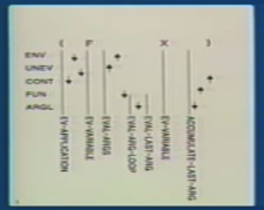
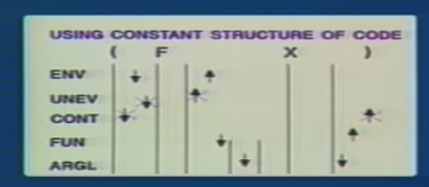
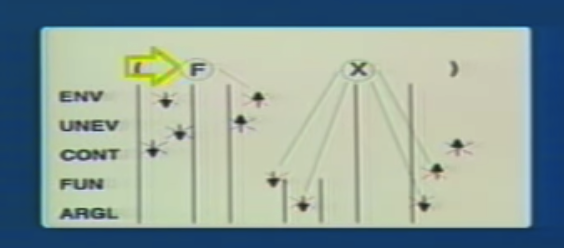
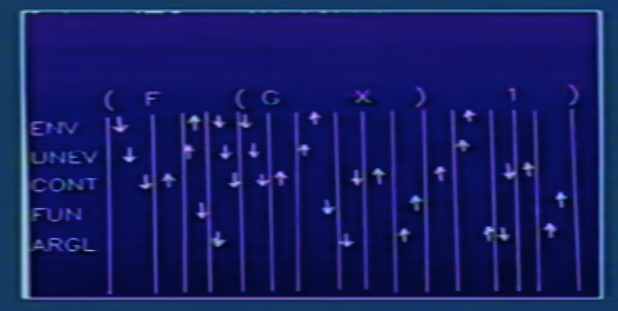
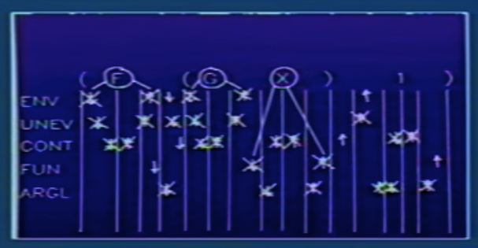

## 10A: Compilation

Hal Abelson

Last time, we took a look at an explicit control evaluator for Lisp, and that bridged the gap between all these high-level languages like Lisp and the query language and all of that stuff, bridged the gap between that and a conventional register machine.

### Part 1:

#### general strategy of interpretation


So that's what an **interpreter** is. It configures itself to emulate a machine whose description you read in.

Now, inside the Lisp interpreter, what's that? Well, that might be your general **register language interpreter** that configures itself to behave like a Lisp interpreter, because you put in a whole bunch of instructions in register language.

This is the **explicit control evaluator**. (Lisp Interprter 中左下云) And then it also has some sort of library, a library of primitive operators and Lisp operations and all sorts ofthings like that.

#### Compilation

对比:

- In **interpretation**, we're raising the machine to the level of our language,like Lisp.
- In **compilation**, we're taking our program and lowering it to the language that's spoken by the machine.

Dual Advantages:(各有千秋)

- The compiler will produce code that executes faster.
- The interpreter is a better environment for debugging.

Well, the idea of a compiler is very much like the idea of an interpreter or evaluator. (interpreter and evaluator are same thing.)

#### 0th compiler

A model for doing that is you **just take the evaluator, you run it over the code**, but instead of executing the actual operations, you just save them away. And that's your compiled code.

Example: Register Operations in interpreting `(F X)`

```lisp
(assign unev (operands (fetch exp)))   ; unev is unevaluate?
(assign exp (operator (fetch exp))) ; no need (13:25), F is above
(save continue)
(save env)
(save unev)
(assign continue eval-args)
(assign val (lookup-val-val (fetch exp) (fetch env)))
(restore unev)
(restore env)
(assign fun (fetch val))
(save fun)
(assign argl '())
(save argl)
```


Dealing with conditionals in a `0th` order compiler:

> So you can't say which one the evaluator would have done. So all you do there is very simple. You compile **both** branches.

```lisp
(IF P A B)
---
<code for P - Result in VAL>
Branch IF VAL is TRUE To Label1
<code for B>
GOTO NEXT-THING
LABEL1 <code for A>
      GOTO  NEXT-THING
```

So that's how you treat a conditional. You generate a little block like that.

And other than that,this **zeroth-order compiler** is the same as the **evaluator**. It's just stashing away the instructions instead of executing them.

**more efficient than the evaluator**. Because, if you watch the evaluator run, it's not only generating the register operations we wrote down, it's also doing things to decide which ones to generate.

> In other words,what the **evaluator's** doing is simultaneously analyzing the code to see what to do, and running these operations. And when you-- if you run the evaluator a million times, that analysis phase happens **a million times**, whereas in the **compiler**, it's happened **once**, and then you just have the register operations themselves.

### Optimizations

分析上述Register: 

- you don't want unev and exp at all. those aren't registers of the actual machine that's supposed to run. Those are registers that have to do with arranging the thing that can simulate that machine.
- So they're always going to hold expressions which, from the compiler's point of view, are just constants, so can be put right into the code. So you can forget about all the operations worrying about exp and unev and just use those constants.


make those kinds of optimizations, get rid, get rid of worrying about exp and unev, and get rid of these irrelevant register assignments to continue, 

```lisp
(save env)
(assign val
        (lookup-var-val 'f (fetch env)))
(restore env)
(assign fun (fetch val))
(save fun)
(assign argl '())
(save argl)
(assign argl
        (cons (fetch val) (fetch argl)))
(restore fun)
```

分析:

- `save env`Then it came back from eval dispatch, restored the environment.
- But the actual thing that you ended up doing didn't trash the argument list. So there was no reason to save it. 
- But the actual thing that you ended up doing didn't trash the argument list.

the **evaluator** has to be maximally pessimistic(悲观的)

But once you've done the analysis, the **compiler** is in a position to say, well, what actually did I need to save? And doesn't need to do any-- it doesn't need to be as careful as the evaluator,because it knows what it actually needs.

```lisp
; Eliminating unnecsssary stack operations

(assign fun
        (lookup-var-val 'f (fetch env)))
(assign val
        (lookup-var-val 'x (fetch env)))
(assign argl (cons (fetch val) '()))

computation proceeds at apply-dispatch
```

 Let me just sort of summarize that in another way, just to show you in a little better picture.



>  This is looking at all the saves and restores
>
>  on the bottom here, the various places in the evaluator that were passed when the evaluation happened.
>
>  Arrow down means register saved. So the first thing that happened is the environment got saved.
>
>  And these -- so there are all the pairs of stack operations.(上图左侧)



> depending on how we set up the discipline of the--of calling other things that apply, we may or may not need to save continue. (最右侧的箭头)



So in fact, all of the stack operations done by the evaluator turned out to be unnecessary or overly pessimistic. And the compiler is in a position to know that.

#### more complicated e.g.:

```lisp
(F (G X) 1)
```

there are something like 16 pairs of register saves and restores as the evaluator walks through that:



But if you say, well, what of those really were the business of the compiler as opposed to the evaluator, you get rid of a whole bunch.



分析(24:40)

So again, the general idea is that the reason the **compiler** can be better is that the interpreter doesn't know *what it's about to encounter*. It has to be maximally pessimistic in saving things to **protect** itself.

And there are two reasons that something might not have to be saved.

- one is that what you're protecting it against, in fact, didn't trash the register, like it was just a variable look-up. 
- And the other one is,that the thing that you were saving it for might turn out not to actually need it.

QA:

1. So the way to think about it is, is maybe you build a chip which is the evaluator, and what the compiler might do is generate code for that chip. It just wouldn't use two of the registers.

### Part 2:

how compiler gets accomplished. And I'm going to give no details.

eg:

```lisp
; Now, the-- what's the code that the compiler should generate?
(OP A1 A2)

{Compile op: Result in FUN} (Preserving ENV)

{Comple A1: Result in VAL} (Pres ENV)
(ASSIGN ARGL (CONS (FETCH VAL) '()))

{Comple A2: Result in VAL} (Pres ARGL)
(ASSIGN ARGL (CONS (FETCH VAL) (FETCH ARGL)))

(GO-TO Apply-Dispatch)
```

- I'll compile the operator:  I'll compile some instructions that will compile the operator and end up with the result in the function register.

what the compiler does is append a whole bunch of code sequences. See, what it's got in it is little primitive pieces of things, like how to look up a symbol, how to do a conditional. Those are all little pieces of things.

So the basic means of combining things is to append two code sequences.

- The idea is that it appends two code sequences, taking care to preserve a register:

  ```lisp
  (APPEND SEQ1 AND SEQ2 RESERVING REG)

  IF SEQ2 needs REG
  AND ESQ1 MODIFYING REG
  (SAVE REG) ;the instructions that the compiler spits out are, save the register.

  You generate this code:
  (SAVE REG) 
  <SEQ1>
  (RESTORE REG)
  (SEQ2)

  ELse:
  <SEQ1>
  <SEQ2>
  ```

And you see, from this point of view, the difference between the interpreter and the compiler, in some sense, is that where the compiler has these preserving notes:

`compiler` maybe I'll actually generate the saves and restores and maybe I won't.That's the **essential difference**.

#### Those have little notations in there about what they need and what they modify.

bottom-level data structures, A code sequence to the compiler lookslike this. It has the actual sequence of instructions.

```markdown
<sequence of inst; set of registers modified; set of regs needed>
```

So that's the information the compiler has that it draws on in order to be able to do this operation.

So for example, a very primitive one, let's see. How about doing a register assignment.

```markdown
< (ASSIGN R1 (fetch R2)) ; {R1} ; {R2} >
```

And now, when it combines two sequences

```markdown
<S1; M1; N1> AND <S2; M2; N2>

s1 follwed by s2
m1 ∪ m2 (modified)
n1 ∪ [n2 - m1] (need)
```

#### Eg: (recursive factorial)

 But it is a perfectly usable rudimentary compiler. Letme kind of show you what it does.

```lisp
(define (fact n)
  (cond ((= n 0) 1)
        (else (* n (fact (- n 1))))))
```

>  And probably one of the reasons that Lisp is slow with compared to languages like FORTRAN is that, if you look over history at the amount of effort that's gone into building Lisp compilers, it's no where near the amount of effort that's gone into FORTRAN compilers. And maybe that's something that will change over the next couple of years.
>
>  (Lisp compiler 性能更好是需要更多的effort的投入.)

QA:

