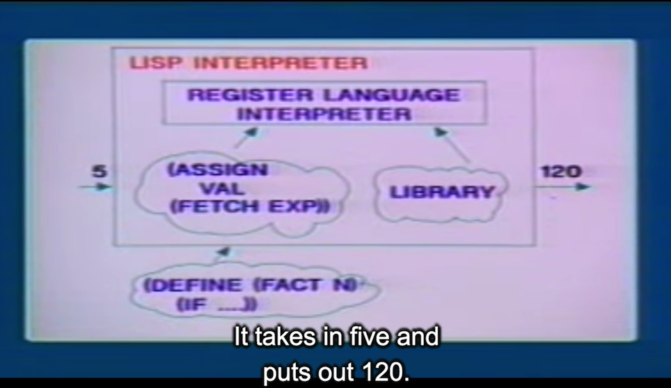

## 10A: Compilation

Last time, we took a look at an explicit control evaluator for Lisp, and that bridged the gap between all these high-level languages like Lisp and the query language and all of that stuff, bridged the gap between that and a conventional register machine.

### Part 1:

#### general strategy of interpretation

So that's what an **interpreter** is. It configures itself to emulate a machine whose description you read in.

Now, inside the Lisp interpreter, what's that? Well, that might be your general **register language interpreter** that configures itself to behave like a Lisp interpreter, because you put in a whole bunch of instructions in register language.

This is the **explicit control evaluator**. (Lisp Interprter 中左下云) And then it also has some sort of library, a library of primitive operators and Lisp operations and all sorts ofthings like that.

目的:

And the point is, what we're doing is we're writing an **interpreter** to raise the machine to the levelof the programs that we want to write.

#### Compilation

对比:

- In interpretation, we're raising the machine to the level of our language,like Lisp.
- In compilation, we're taking our program and lowering it to the language that's spoken by the machine.

The compiler can produce code that will execute more efficiently.

- The essential reason for that is that if you think about the register operationsthat are running, the interpreter has to produce register operations which, in principle, are goingto be general enough to execute any Lisp procedure. 
- Whereas the compiler only has to worryabout producing a special bunch of register operations for, for doing the particular Lispprocedure that you've compiled.
- Or another way to say that is that the interpreter is a general purpose simulator, that when you read in a Lisp procedure, then those can simulate the program described by that, by that procedure. So the interpreter is worrying about making a general purpose simulator, 
- whereas the compiler, in effect, is configuring the thing to be the machine that the interpreter would have been simulating.

On the other hand, the interpreter is a nicer environment for debugging. 

- we've got the source code actually there. We're interpreting it.That's what we're working with. 
- And we also have the library around. See, the interpreter--the library sitting there is part ofthe interpreter.

Dual Advantages:(各有千秋)

- The compiler will produce code that executes faster.
- The interpreter is a better environment for debugging.

Well, the idea of a compiler is very much like the idea of an interpreter or evaluator. (interpreter and evaluator are same thing.)

Well, the compiler essentially would like to walk over the code and produce the register operations that the evaluator would have done were it evaluating the thing. And that gives us a model for how to implement a **zeroth-order** compiler, a very bad **compiler** but essentially a compiler. A model for doing that is you **just take the evaluator, you run it over the code**, but instead of executing the actual operations, you just save them away. And that's your compiled code.

Eg: