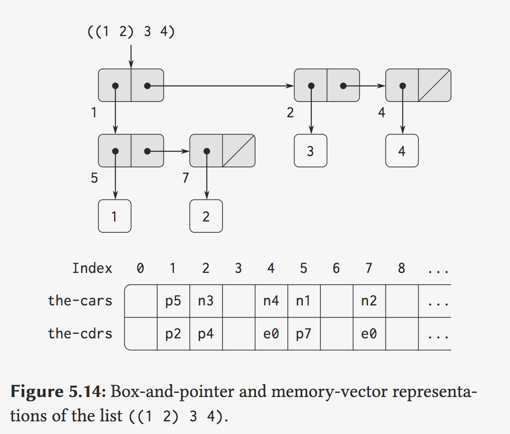
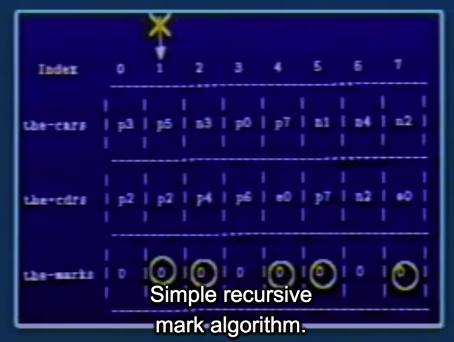

## 10B: Storage Allocation and Garbage Collection

Gerald Jay Sussman

### Part 1:

Memory, the glue that data structures are made of.

举例一种表示方式:

**Gödel** came up with a scheme to encode expressions as numbers.

If objects ar represented by numbers then:

- `(cons x y)` => `2^x 3^y`
- `(car x)` => the number of factors of 2 in `x`
- `(cdr x)`=> the number of factors of 3 in `x`

也可以用`boxes`来表示:

On the other hand, there are other ways of representing these things. We have been thinking in terms of little boxes. 

引出问题:

```markdown
2nd: To model computer memory, we use a new kind of data structure called a vector. (http://sarabander.github.io/sicp/html/5_002e3.xhtml#g_t5_002e3)

In order to describe memory operations, we use two primitive Scheme procedures for manipulating vectors:

- (vector-ref ⟨vector⟩ ⟨n⟩) returns the nthnth element of the vector.
- (vector-set! ⟨vector⟩ ⟨n⟩ ⟨value⟩) sets the nthnth element of the vector to the designated value.

We can use vectors to implement the basic pair structures required for a list-structured memory. Let us imagine that computer memory is divided into two vectors: the-cars and the-cdrs.

to extending the notion of “pointer” to include information on data type.
eg: A pointer to a number, such as n4, might consist of a type indicating numeric data together with the actual representation of the number 4.
```

Now the problem is how are we going to impose on this type of structure, this nice tree structure.

So we're going to have to imagine imposing this complicated tree structure on our nice linear memory.



 What is stored in each of these pigeonholes is a typed object.e `p`, standing for a `pair`. Or `n`,standing for a `number`.Or `e`, standing for an `empty list`.

下一个问题:

So this is the traditional way of representing this kind of binary tree in a linear memory. Now the next question, of course, that we might want to worry about is just a little bit of implementation.

#### Vector

Now of course in order to write that down I'm going to introduce some sort of a structure called a `vector`. (I don't think that name is the right word.)

Machine code instructions like `assign` and `fetch` actually access these arrays.

```lisp
;; Accessors
(vector-ref  vector index)
(vector-set! vector index value)

(assign a (car (fetch b)))
====>
(assign a (vector-ref (fetch the-cars) (fetch b)))

(assign a (cdr (fetch b)))
====>
(assign a (vector-ref (fetch the-cdrs) (fetch b)))

(perform (set-car! (fetch a) (fetch b)))
====>
(perform (vector-set! (fetch the-cars) (fetch a) (fetch b)))

(perform (set-cdr! (fetch a) (fetch b)))
====>
(perform (vector-set! (fetch the-cdrs) (fetch a) (fetch b)))
```


#### Implementing the primitive list operations

Given the above representation scheme, we can replace each “primitive” list operation of a register machine with one or more primitive vector operations. We will use two registers, `the-cars` and `the-cdrs`, to identify the memory vectors, and will assume that `vector-ref` and `vector-set!` are available as primitive operations. 

2nd:

> We presume that there is a special register, `free`, that always holds a pair pointer containing the next available index, and that we can increment the index part of that pointer to find the next free location. (下面插入一个新的cell 用到了free)

eg: Here we have the free list starting in 6.

```lisp
; With freelist method of allocation

(assign a (cons (fetch b) (fetch c)))
===>

(assign a (fetch free))
(assign free
        (vector-ref (fetch the cdrs)
                    (fetch free)))
(perform (vector-set! (fetch the-cars)
                      (fetch a)
                      (fetch b)))
(perform (vector-set! (fetch the-cdrs)
                      (fetch a)
                      (fetch b)))
```

提出问题:

> So the only problem really remaining here is, well, I don't have an **infinitely** large memory. If I dothis for a little while, say, for example, supposing it takes me a **microsecond to do a cons**, and I have a million cons memory then I'm only going to run out in a **second**, and that's pretty bad.

 ### Part 2: Garbage

e.g.: append two lists together

> one way to do it is to reverse the first listonto the empty list and reverse that onto the second list.

```lisp
; A source of garbage

(define (rev-loop x y)
  (if (null? x)
      y
      (rev-loop (car x)
                (cons (car x) y))))

(define (append u v)
  (rev-loop (rev-loop u '()) v))
```

Garbaga: the intermediate result, which is the reversal of the first list as done by thisprogram, is never going to be accessed ever again after it's copied back on to the second.(第一个List反转后的结果, 再使用之后is useless.)


We've designed our computers to look sort of like this. (23:30)

Now the truth of the matter is that the entire consciousness of this machine is in these registers.

#### mark-sweep GC

Anything which is not so marked is **garbage** and can be recycled.

Eg:



every time I come across an unmarked thing I'm going to link it together in myfree list.


Let's look at the mark phase. Here's the first part of the mark phase.

```lisp
gc   (assign thing (fetch root))
     (assign continue sweep)

;; Marking Process
mark (branch (not-pair? (fetch thing))
             done)

pair (assign mark-flag
             (vector-ref (fetch the-marks)
                         (fetch thing)))
     (branch (= (fetch mark-flag) 1)
             done)
     (perform
      (vector-set! (fetch the-marks)
                   (fetch thing)
                   1))

;; Mark car of things
mcar (push thing)
     (push continue)
     (assign continue mcdr)
     (assign thing (vector-ref (fetch the-cars) (fetch thing)))
     (goto mark)

done (goto (fetch continue))

;; Sweeping Process
sweep
    (assign free '())
    (assign scan (-1+ (fetch memtop)))    ;; Start from the top of the memory
scan-loop
    (branch (negative? (fetch scan)) end)
    (assign mark-flag (vector-ref (fetch the-marks) (fetch scan)))
    (branch (= (fetch mark-flag) 1) unmark)
    (perform (vector-set! (fetch the-cdrs) (fetch scan) (fetch free)))
    (assign free (fetch scan))
    (assign scan (-1+ (fetch scan)))
    (goto scan-loop)

unmark
    (perform (vector-set! (fetch the-marks) (fetch scan) 0))
    (assign scan (-1+ (fetch scan)))
    (goto scan-loop)
end
```

sweep phase: 

> And I described to you what this sweep is like. I'm going to walk down from one end ofmemory or the other, I don't care where, scanning every cell that's in the memory. And as I scanthese cells, I'm going to link them together, if they are free, into the free list. And if they're notfree, I'm going to unmark them so the marks become zero.

#### Minsky-Fenichel-Yochelson algorithm

内存分为两块(fromSpace, toSpace)

scan, copy.(copy后的是一块连续的空间)

>  I believe no one has found a faster algorithm than that.

QA:

1. One thing you should realise is that garbage collectors have to be small.Not because they have to be fast, but because no one can debug a complicated garbage collector. A garbage collector, if it doesn't work, will trash your memory in such a way that you cannot figure out what the hell happened.

### Part 3:

The answer is yes, there are things you can't compute.

eg:(44:04)

you'd like a program that would check that the thing you're going to do will work.

```lisp
; And what s does is it determines whether or not it's safe to run p on a.
s[p, a] = 
1. true: if p applied to a will converge to a value without an error
2. false: if p of a loops forever or makes an error
```

提出问题:

But the question is, can you write a procedure that compute the values of this function? Well let's assume that we can.

1. 第一种证明方式:


 Suppose that we have a procedure called "safe" that computes the value of s. Now I'm going to show you by several methods that you can't do this.

通过悖论来证明?

```
(define diag1
  (lambda (p)
    (if (safe? p p)
      (inf)
      3)))

(define inf
  (lambda ()
    ((lambda (x) (x x))
      (lambda (x (x x))))))

(diag1 diag1) => ?
```

if it's safe ot run `diag1` then it will go into an infinite loop which makes it, by definition, unsafe.

if it's unsafe, the answer is `3`, so it's safe.

Note: the `diag` name is a nod to [Cantor's diagonal argument](https://en.wikipedia.org/wiki/Cantor's_diagonal_argument). (历史原因: These are instances of a famous argument which was originally used by Cantor in the late part of the last century to provethat the real numbers were not countable, that there are too many real numbers to be countedby integers. )

2. 第二种证明:

```
(define diag2
  (lambda (p)
    (if (safe? p p)
      (other-than (p p))
      false)))

;; Always produces something else than its argument is
(define other-than
  lambda (x)
    (if (= x 'A) 'B 'A))

(diag2 diag2) => (other-than (diag2 diag2)) ?!?
```

QA:

So I think that the standard top down design is a rather shallow business.