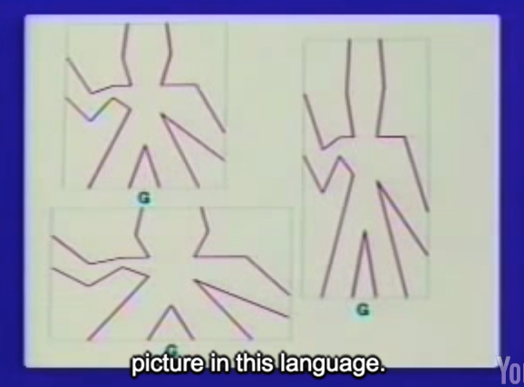

## Henderson Escher Example

Hal Abelson

### Part 1

#### Review : compound data

1. isolate the way that data object are used from the way that they're represented
2. Lisp pairs.

#### reivew: vectors

```lisp
; Using Vector

(define (+vect v1 v1)
  (make-verctor
   (+ (xcor v1) (xcor v2))
   (+ (ycor v1) (ycor v2))))

(define (scale s v)
  (make-vector (* s (xcor v))
               (* s (ycor v))))

; slight different before
(define (make-vector cons))
(define (xcor car))
(define (ycor cdr))
```

procedure can be objects, and that you can name them.

作一条线段，起点(2,3)，终点 (5,1)

```lisp
; Representing line segment

(define make-seg cons)
(define segment-start car)
(define segment-end cdr)

(make-seg (make-vect 2 3)
          (make-vect 5 1))
```

#### a notion of closure

> closure was the thing that allow us to build up complexity.
>
> Or as a mathematician might say, the set of data objects in List is closed under the operation of forming pairs. (数学家的说法，List中的数据集合在pairs操作下是封闭的。)

#### For example ，glue four things:  1，2，3，4,  there are a lot of ways.

#### List

> List is essentially, just a convention for representing sequence.


`List` primitive just a abbreviation(缩写) for nested cons.

```lisp
(DEFINE 1-TO-4 (List 1 2 3 4))

(CAR (CDR 1-To-4)) -> 2
```


```lisp
(SCALE-LIST 10 1-TO-4) -> (10 20 30 40)
(MAP SQUARE 1-To-4) -> (1 4 9 16)
(MAP (LAMBDA (X) (+ X 10)) 1-TO-4) -> (11 12 13 14)

; CDR-ing down a list 
(define (scale-list s l)
  (if (null? l)
      nil
      (cons (* (car l) s)
            (scale-list s (cdr l)))))
```

### map

> take a list l , and take a procedure p, apply p to each element in l. and return a new list.

```lisp
; general procedure called map
(define (map p l)
  (if (null? l)
      nil
      (cons (p (car l))
            (map (cdr l)))))

(define (scale-list s l)
  (map (lambda (item) (* item s))
       l))
```


#### Really really important : stop thinking about control structure, start thinking about operations on aggregates(总数). we'll see when we talk about something called **stream processing**.

some thing like map is called for-each

```lisp
(define (for-each proc list)
  (cond ((null? list) *done*)
    (else (proc (car list))
          (for-each proc
                    (cdr list)))))
```

### Part 2

#### the major third theme in this course: meta-linguistic abstraction

```markdown
PRIMITIVES
MEANS OF COMBINATION
MEANS OF ABSTRACTION

```

#### primitive (here is picture)


Peter Henderson's **language** was for describing figures that look like that and designing new ones that look like that and drawing them on a display screen

> And anyway I hope by the end of this morning, if you're not already, you will be completely confused about what the difference between procedures and data are.
> Peter Henderson's Language Has only one primitive `picture`.

Picture就是draw a figure(图形)，让它fit 一个矩形.



上图的three things are the same `picture`,I'm just giving it different rectangles to scale itself.

#### means of combination & operation

1. means of combination of one element

   - Rotate (旋转 : may be 90 degree)


- Flip (翻转 either horizontallyor vertically)

2. means of combination, put things together

   - Besides (两张图片,水平方向,根据比例Fit 一个矩形)
   - Above (vertically, 垂直方向)

example:


```lisp
; Beside G with (Above empty picture and G)
(BESIDE G
        (ABOVE EMPTY G .5)
        .5)
```


```lisp
(DEFINE P
        (BESIDE G
                (ROTATE (FLIP G) 180)
                .5))
```


```lisp
(DEFINE Q
        (ABOVE P (FLIP P) .5))
```

#### Why we do it fast. The answer is it's **closure** property.

The world of picture is closed under those means of combination.(Rotate , Flip etc..)

operations are closed.

#### let's talk about how this language is actually implemented.

The basic element that sits under the table here is a thing called a **rectangle**:

```lisp
rectangle:
- horiz
- vert
- origin (vector)

; constructor
(MAKE-RECT)
; selectors
HORIZ
VERT
ORIGIN
```

that's George's problem. It's just a data representation problem. So let's assume we have these rectangles to work with.

我们需要考虑的是，每当give you a rectangle，a transformation from the standard square(单位正方形) into that rectangle.

(x, y) -> ORIGIN  + (x * HORIZ, y*VERT)

把单位正方形中的point，以Origin为原点，做伸缩。

 So any rectangle defines a **coordinate MAP**, which is a procedure on points:

```lisp
(define (coord-map rect)
  (lambda (point)
          (+vect
           (+vect (scale (xcor point)
                         (horiz rect))
                  (scale (ycor point)
                         (vert rect)))
           (origin rect))))
```

What's a picture have to be? First of all it's a procedure that's defined on rectangles.

For-each Seglists, get its start and end, transforms that by the coordinate MAP of the rectangle.


```lisp
;Constructing Primitive Pictures from Lists of Segments

(define (make-picture seglist)
  (lambda (rect)
          (for-each
           (lambda (s)
                   (drawline
                    ((coord-map rect) (seg-start s))
                    ((coord-map rect) (seg-end s))))
           seglist)))
```

```lisp
(DEFINE R (MAKE-RECT ...))

(DEFINE G (MAKE-PICTURE ...)) ; here stuff is List of line segment using MAKE-SEGMENT

; picture is a procedure that takes a rectangle as argument
(G R)
```

给一张图片一个Rectangle, 它就会Draw the picture to Fit the Rectangle.

### Part 3

 The reason it's nice is that once you've implemented the primitives in this way, the means of combination just fall out by implementing procedures.

```lisp
; p1 go do your thing in one rectangle
; p2 go do your thing in another rectangle
(define (beside p1 p2 a)
  (lambda (rect)
          (p1 (make-rect
               (origin rect)
               (scale a (horiz rect))
               vert rect))
          (p2 (make-rect
               (+vect (origin rect)
                      (scale a (horiz rect)))
               (scale (- 1 a) (horiz rect))
               (vert rect)))))

(define (rotate90 pict)
  (lambda (rect)
          (pict (make-rect
                 (+vect (origin rect)
                        (horiz rect))
                 (vert rect)
                 (scale -1 (horiz rect))))))
```

个人理解 build system in layers:

```markdown
Picture(Beside 其实是对RCECTANGLE进行操作,然后调用MAKE-PICTURE)

---
MAKE-PICTURE
---

RECTANGLE

---
MAKE-RECT/ORGIN/VERT/HORIZON
---

POINT, VECTOR
```


#### The technical term I want to say is not only is this language implemented in List,obviously it is, but the language is nicely **embedded** in List

recursive means of combination

```lisp
(DEFINE (RIGHT-PUSH P N A)
        (IF (= N D)
            P
            (BESIDE P (RIGHT-PUSH P
                                  (- N 1)
                                  A)
                    A)))
```


> Right, the important point, the difference **between** merely implementing something in a language **and** embedding something in the language, so that you don't lose the original power of the language, and what List is great at, see List is a lousy language for doing any particular problem. What it's **good** for is figuring out the right language that you want and **embedding** that in List. That's the real power of this approach to design.

```lisp
(DEFINE (PUSH COMB)
        (LAMBDA (PICT N A)
                ((REPEATED
                  (LAMBDA (P) (COMB PICT P A))
                  N)
                   PICT)))

(DEFINE RIGHT-PUSH (PUSH BESIDE))
```

> The main point I've been dwelling on is the notion of nicely embedding a language inside another language. Right, so that all the power of this language like List of the surrounding language is still accessible to you and appears as a natural extension of the language that you built.

#### decompose task to sub-tree task is not robust.

each node to do specific task

#### Design in language level.

```markdown

---
LANGUAGE OF
SCHEMES OF COBINATION
---

---
LANGUAGE OF 
GEOMETRIC POSITION (Like Rotate,Besides)

---

---
LANGUAGE OF
PRIMITIVE PICTS
---
```

> that's sort of a big point about the **difference** in software methodology that `comes out from List`, **and** it all `comes, again, out of the notion that really, the design process` is **not so much** `implementing programs` **as** `implementing languages`. And that's really the powerful of List.