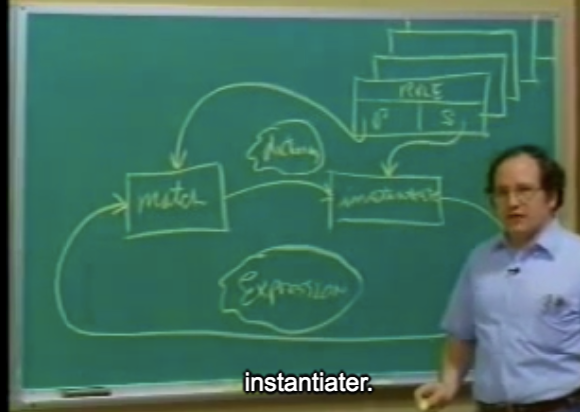
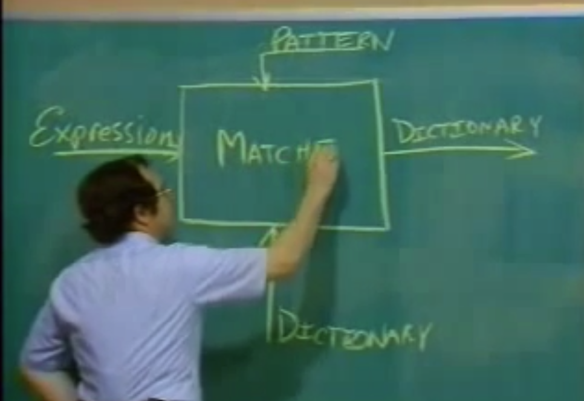
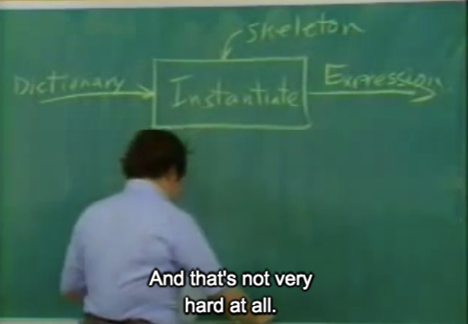

## 4A: Pattern Matching and Rule-based Substitution

Gerald Jay Sussman

### Part 1

is there some other way of writing this program that's more clear?

3B写的deriv，能不能表达的更clear.

```markdown
           Rule
  Patter -----------> Skeleton(骨架)
    |                    |
    |                    |
    | mactch             | instantiation
    |                    |
    v                    v
Expression |------>  Expression
  Source               target
```

>  And what we're going to do is instead of bringing the rules to the level of the computer by writing a program that is those rules in the computer's language -- at the moment, in a Lisp-- we're going to bring the computer to the level of us by writing a way by which the computer can understand rules of this sort.

```lisp
(define deriv-rules
  '(
    ( (dd (?c c) (? v))                0)
    ; since this v appears twice, we're going to want that to mean they have to be the same.
    ( (dd (?v v) (? v))                1)
    ( (dd (?v u) (? v))                0)
    
    ( (dd (+ (? x1) (? x2)) (? v))
     ; colons(冒号)
      (+ (dd (: x1) (: v))
         (dd (: x2) (: v)))             )
    
    ; x加y的和求导
    ( (dd (+ (? x1) (? x2)) (? v))
      (+ (+ (: x1) (dd (: x2) (: v)))
         (+ (dd (: x1) (: v)) (: x2)))  )
    
    
    ( (dd (** (? x) (?c a)) (? v))
      (* (* (: a)
            (** (: x) (: (+ a 1))))
         (dd (: x) (: v)))              )
    
    
    
    ))
```

**Colons** `:` here will stand for **substitution objects**. They're--we'll call them **skeleton evaluations**.

go on for this rule language

#### pattern matching

```markdown
Pattern match

foo --- matches exactly foo
(f a b) --- match any list whose first element is f, 
            whose second element is a, and whose third element is b
            
            
(? x) --- matches anything, call it x
(?c x) --- matches a constant, call it x
(?v x) --- matches a variable, call it x
```

```markdown
Skeletons for instantiation(实例化)

foo  --- instantiates to itself
(f a b) --- instantiates to a 3.list which are the result of instantiating
         each of f, a , and b.
(: x) --- instantiate to the value of x as in the matched pattern
```

####  simplifier

What would we do with such a thing once we have it? Well, one of the nicest ideas, first of all, is I'm going to write for you, and we're going to play with it all day. What I'm going to write for you is a program called **simplifier**.

```lisp
(DEFINE DSIMP
        (SIMPLIPIER DERIV-RULE))

; eg
]=> (DSIMP '(dd (+ x y) x))
(+ 1 0)
```

#### algebraic manipulation rules

```lisp
(define algebra-rules '(
	( ((? op) (?c e1) (?c e2))
      (: (op e1 e2))                     )
    
	; 此表达式对除法有bug
    ( ((? op) (? e1) (?c e2))
      ((: op) (: e2) (: e1))             )
                        
	( (+ 0 (? e))                   (: e))
	( (* 1 (? e))                   (: e))
	( (* 0 (? e))                   0    )
     
	; 乘法交换律
	( (* (?c e1) (* (?c e2) (? e3)))
      (* (: (* e1 e2)) (: e3)))
                        
	;
	( (+ (? e1) (+ (?c e2) (? e3)))
      (+ (: e2) (+ (: e1) (: e3)))       )
                        
	( (* (* (? e1) (? e2)) (? e3))
      (* (: e1) (* (: e2) (: e3)))       )
                        
	( (+ (?c e1) (+ (?c e2) (? e3)))
      (+ (: (' e1 e2)) (: e3))           )
	
	; ... 17:43
                        ))
```

> Now, what exactly these rules are doesn't very much interest me. We're going to be writing thelanguage that will allow us to interpret these rules so that we can, in fact, make up what ever rules we like, another whole language of programming.

Ques: How is the simplifier program going to manipulate these rules with your expression to produce areasonable answer?




QA: 

recursive loop, 

I would like to teach you how to do it so you don't depend upon some language designer.

You make it yourself. You can roll your own.(教我们一种实现方式，可以不受language 约束？)


### Part 2 matching and instantiation




```lisp
(define (match pat exp dict)
  (cond ((eq? dict 'failed) 'failed)
    	((atom? pat)
         *** Atomic patterns)
    	*** Pattern variable clauses
    	; pattern not atomic, but exp is atomis , so failed
    	((atom? exp) 'failed)
    	(else
         (match (cdr pat)
                (cdr exp)
                (match (car pat)
                       (car exp)
                       dict)))))
```

e.g.:

```lisp
; a pattern
(+ (* (? X) (? Y)) (? Y))

; an expression
(+ (* 3 x) x)
```


> my pattern variable, `x` match `3`, in my dictionary, and the dictionary's going to follow along with me: `x` equals `three`

解释第一个条件判断分局

this matcher takes the dictionary from the previous match as input, it must be able to propagate(产生) the failures. And so that's what the first clause of this conditional does.


#### atomic patter

```lisp
((atom? pat)
 (if (atom? exp)
     (if (eq? pat exp)
         dict
         'failed)
     'failed))
```

```lisp
((arbitrary-constant? pat)
 (if (constant? exp)
     (extend-dict pat exp dict)
     'failed))

((arbitrary-variable? pat)
 (if (variable? exp)
     (extend-dict pat exp dict)
     'failed))

((arbitrary-expression? pat)
 (extend-dict pat exp dict))
```


So you've just seen a complete, very simple matcher. Now, one of the things that's rather remarkable about this is people pay an awful lot of money these days for someone to make a,quote, AI expert system that has nothing more in it than a matcher and maybe an instantiater like this.

#### instantiater

the purpose of the instantiater is to make expressions given a dictionary and a skeleton.



```lisp
(define (instantiate skeleton dict)
  (define (loop s)
    (cond ((atom? s) s)
      ((skeleton-evaluation? s)
       (evaluate (eval-exp s) dict))
      (else (cons (loop (car s))
                  (loop (cdr s))))))
  (loop skeleton))
```

To instantiate a skeleton, given a particular dictionary-- oh, this is easy. We're going to do a recursive tree walk over the skeleton. And for everything which is a `skeleton variable` -- I don't know, call it a `skeleton evaluation`. That's the name and the abstract syntax that I give it in this program: a skeleton evaluation, a thing beginning with a colon in the rules.(有冒号开头的变量)

a little about `evaluate`:

```lisp
(define (evaluate form dict)
  (if (atom? form)
      (loopup form dict)
      (apply
       ; I want you realize you're seeing magic now. 
       ; This magic will become clear very soon, but not today.
       (eval (koopup (car form) dict)
             user-initial-enviroment)
       (mapcar (lambda (v)
                 (lookup v dict))
               (cdr form)))))
```


QA：

 All you've got there is we're making up the dictionary for later substitution.

### Part 3

Now we have to understand the control structure by which the rules are applied to the expressions so as to do algebraic simplification.

之前是一种`GIGC`: garbage- in, garbage-out simplifier.

```lisp
(define (simplifier the-rules)
  (define (simplify-exp exp)
    ***)
  (define (simplify-parts exp)
    ***)
  simplify-exp)
```

And then the result of this simplifier procedure is, in fact, one of the procedures that was defined.

```lisp
(define (simplify-exp exp)
  (try-rules (if (compound? exp)
                 (simplify-parts exp)
                 exp)))

(define (simplify-parts exp)
  (if (null? exp)
      '()
      (cons (simplify-exp (car exp))
            (simplify-parts (cdr exp)))))
```

