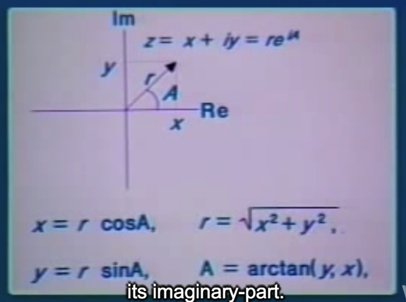

## 4B: Generic Operators

Hal Abelson

### Part 1 

先提到Date abstraction.

Somehow in designing a system, you not only want these **horizontal barriers**(分离 Use & Representation), but you also want some kind of **vertical barrier** to keep George and Martha (实现Representation的两个人) separate.

#### 以Personal Record举例

More than that, you'd like to design the system so that the next time a new division comes intothe company they don't have to make any big changes in what they're already doing to link intothis system

the Problem that we'll talking about today:(课程内容)

So that's the problem you should be thinking about. Like it's sort of just your work. You want to be able to include new things by making minimal changes.

#### do atrthmetic on complex numbers(复数运算)

real- and imaginary-part



rectangular representation, real- and imaginary-part, or polar representation. (直角坐标系, 极坐标)

magnitude and angle

```lisp
;;; Arithmetic operations on
;;; complex numbers

(define (+c z1 z2) ...)

(define (-c z1 z2) ...)

(define (*c z1 z2) ...)

(define (/c z1 z2) ...)
```

What are the actual formulas for manipulating such things? 

```lisp
Re (Z1 + Z2) = (Re Z1) + (Re Z2)
Im (Z1 + Z2) = (Im Z1) + (Im Z2)

Mag (Z1 * Z2) = (Mag Z1) * (Mag Z2)
Angle (Z1 * Z2) = (Angle Z1) + (Angle Z2)
```


```lisp
; SELECTORS
(REAL-PART Z)
(IMAG-PART Z)
(MAGNITUDE Z)
(ANGLE Z)

; CONSTRUCTORS
(MAKE-RECTANGULAR X Y)
(MAKE-POLAR R A)
```


```lisp
(define (+c z1 z2)
  (make-rectangular
   (+ (real-part z1) (real-part z2))
   (+ (imag-part z1) (imag-part z2))))

; substraction is the same

(define (*c z1 z2)
  (make-polar
   (* (magnitude z1) (magnitude z2))
   (+ (angle z1) (angle z2))))

(define (/c z1 z2)
  (make-polar
   (/ (magnitude z1) (magnitude z2))
   (- (angle z1) (angle z2))))

```

Geoge implement representation

```lisp
;;; Representing complex numbers as
;;; pairs REAL-PART, IMAGINARY-PART

(define (make-reactangular x y)
  (cons x y))

(define (real-part z) (car z))

(define (imag-part z) (cdr z))

(define (make-polar r a)
  (cons (* r (cos a)) (* r (sin a))))

(define (magnitude z)
  (sqrt (+ (square (car z))
           (square (cdr z)))))

(define (angle z)
  (atan (cdr z) (car z)))
```

Martha represent a complex number as a pair of a magnitude and an angle

```lisp
;;; Representing complex numbers as 
;;; pairs MAGNITUDE.ANGLE

(define (make-polar r a) (cons r a))

(define (magnitude z) (car z))

(define (angle z) (cdr z))

(define (make-rectangle x y)
  (cons (sqrt (+ (square x) (square y)))
        (atan y x)))

(define (real-part z)
  (* (car z) (cos (cdr z))))

(define (imag-part z)
  (* (car z) (sin (cdr z))))
```

#### Generic Operators

```markdown
    +c  -c  *c  /c
    
-----------------------------------------------------------------
REAL-PART    IMAG-PART   MAG    ANG     (generic operators)
-----------------------------------------------------------
                    | |
                    | |
   RECT             | |         POLAR
                    | |
                    | |
                    | |

```

There's actually a really obvious idea, if you're used to thinking about complex numbers. If you're used to thinking about **compound data**.(用这种方法去思考compound data.)

#### TYPED DATA

```lisp
;;; Support mechanism for manifest types

(define (attach-type type contents)
  (cons type contents))

(define (type datum)
  (car datum))

(define (contents datum)
  (cdr datum))
```

```lisp
;;; type predicates

(define (rectangular? z)
  (eq? (type z) 'rectangular))

(define (polar? z)
  (eq? (type z) 'polar))
```

Geoge:

```lisp
;;; Rectangular package (rectangular 部分是相对之前需要改变的部分)

(define (make-rectangular x y)
  (attach-type 'rectangular (cons x y)))

(define (real-part-rectangular z)
  (car z))

(define (imag-part-rectangular z)
  (cdr z))

(define (magnitude-rectangular z)
  (sqrt (+ (square (car z))
           (square (cdr z)))))

(define (angle-rectangular z)
  (atan (cdr z) (car z)))
```

Martha changes:

```lisp
;;; Polar package

(define (make-polar r a)
  (attach-type 'polar (cons r a)))
 
(define (real-part-polar z)
  (* (car z) (cos (cdr z))))

(define (imag-part-polar z)
  (* (car z) (sin (cdr z))))

(define (magnitude-polar z) (car z))

(define (angle-polar z) (cdr z))
```

#### Generic Selectors

```lisp
(define (REAL-PART z)
  (cond ((rectangular? z)
         (real-part-rectangular
          (contents z)))
        ((polar? z)
         (real-part-polar
          (contents z)))))

(define (IMAG-PART z)
  (cond ((rectangular? z) ...)
        ((polar? z) ...)))

(define (MAGNITUDE z)
  (cond ((rectangular? z) ...)
        ((polar? z) ...)))

(define (ANGLE z)
  (cond ((rectangular? z) ...)
        ((polar? z) ...)))
```

So there's a system. Has three parts. There's sort of George, and Martha, and the manager.