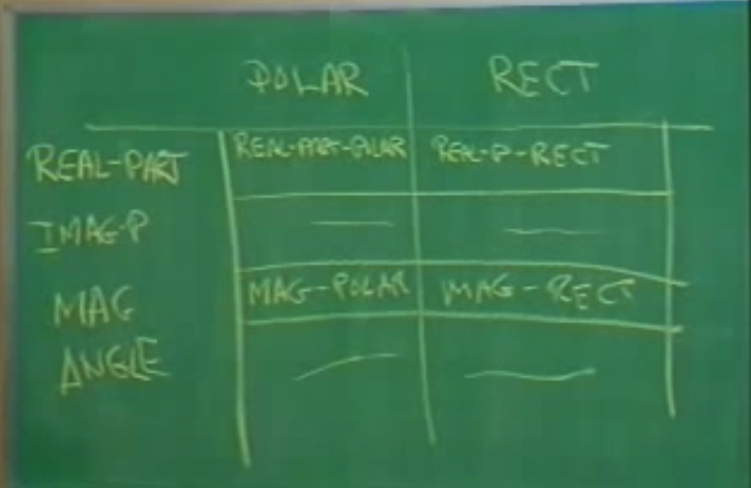
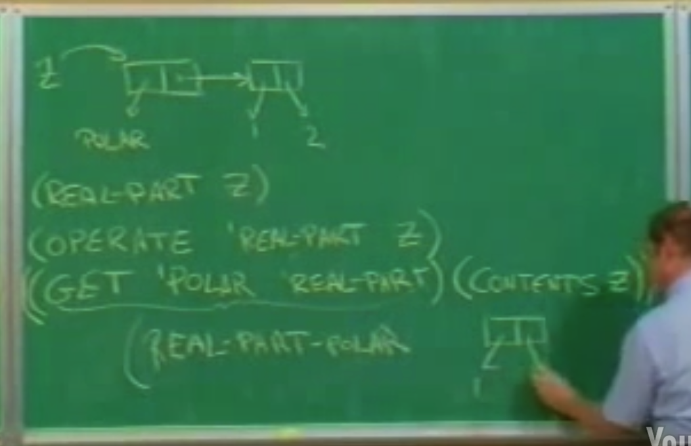
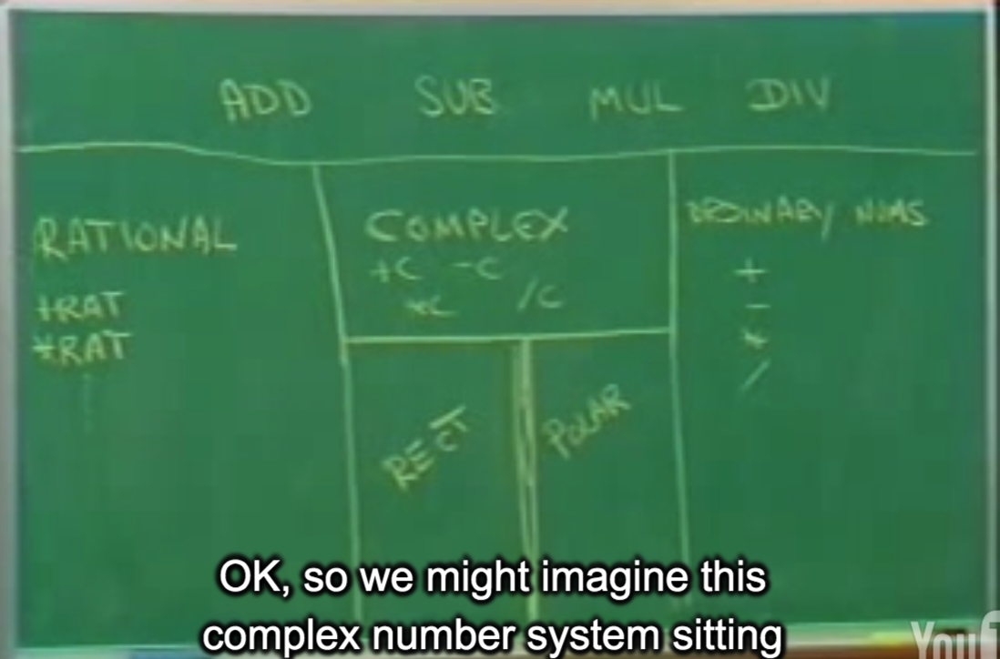
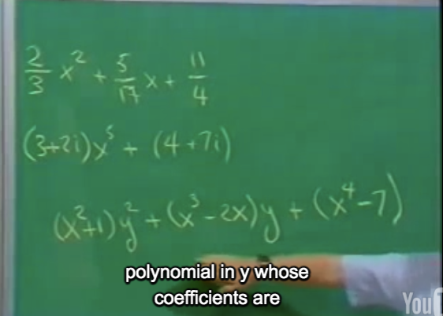
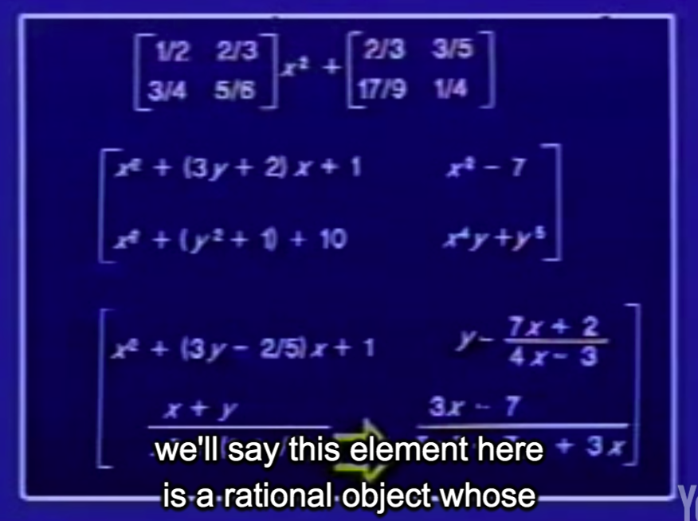

## 4B: Generic Operators

Hal Abelson

### Part 1 

先提到Data abstraction.

Somehow in designing a system, you not only want these **horizontal barriers**(分离 Use & Representation), but you also want some kind of **vertical barrier** to keep George and Martha (实现Representation的两个人) separate.

#### 以Personal Record举例

More than that, you'd like to design the system so that the next time a new division comes intothe company they don't have to make any big changes in what they're already doing to link intothis system

the Problem that we'll talking about today:(课程内容)

So that's the problem you should be thinking about. Like it's sort of just your work. You want to be able to include new things by making minimal changes.

#### do atrthmetic on complex numbers(复数运算)

real- and imaginary-part


rectangular representation, real- and imaginary-part, or polar representation. (直角坐标系, 极坐标)

magnitude and angle

```lisp
;;; Arithmetic operations on
;;; complex numbers

(define (+c z1 z2) ...)

(define (-c z1 z2) ...)

(define (*c z1 z2) ...)

(define (/c z1 z2) ...)
```

What are the actual formulas for manipulating such things? 

```lisp
Re (Z1 + Z2) = (Re Z1) + (Re Z2)
Im (Z1 + Z2) = (Im Z1) + (Im Z2)

Mag (Z1 * Z2) = (Mag Z1) * (Mag Z2)
Angle (Z1 * Z2) = (Angle Z1) + (Angle Z2)
```


```lisp
; SELECTORS
(REAL-PART Z)
(IMAG-PART Z)
(MAGNITUDE Z)
(ANGLE Z)

; CONSTRUCTORS
(MAKE-RECTANGULAR X Y)
(MAKE-POLAR R A)
```


```lisp
(define (+c z1 z2)
  (make-rectangular
   (+ (real-part z1) (real-part z2))
   (+ (imag-part z1) (imag-part z2))))

; substraction is the same

(define (*c z1 z2)
  (make-polar
   (* (magnitude z1) (magnitude z2))
   (+ (angle z1) (angle z2))))

(define (/c z1 z2)
  (make-polar
   (/ (magnitude z1) (magnitude z2))
   (- (angle z1) (angle z2))))

```

Geoge implement representation

```lisp
;;; Representing complex numbers as
;;; pairs REAL-PART, IMAGINARY-PART

(define (make-reactangular x y)
  (cons x y))

(define (real-part z) (car z))

(define (imag-part z) (cdr z))

(define (make-polar r a)
  (cons (* r (cos a)) (* r (sin a))))

(define (magnitude z)
  (sqrt (+ (square (car z))
           (square (cdr z)))))

(define (angle z)
  (atan (cdr z) (car z)))
```

Martha represent a complex number as a pair of a magnitude and an angle

```lisp
;;; Representing complex numbers as 
;;; pairs MAGNITUDE.ANGLE

(define (make-polar r a) (cons r a))

(define (magnitude z) (car z))

(define (angle z) (cdr z))

(define (make-rectangle x y)
  (cons (sqrt (+ (square x) (square y)))
        (atan y x)))

(define (real-part z)
  (* (car z) (cos (cdr z))))

(define (imag-part z)
  (* (car z) (sin (cdr z))))
```

#### Generic Operators

```markdown
    +c  -c  *c  /c
    
-----------------------------------------------------------------
REAL-PART    IMAG-PART   MAG    ANG     (generic operators)
-----------------------------------------------------------
                    | |
                    | |
   RECT             | |         POLAR
                    | |
                    | |
                    | |

```

There's actually a really obvious idea, if you're used to thinking about complex numbers. If you're used to thinking about **compound data**.(用这种方法去思考compound data.)

#### TYPED DATA

```lisp
;;; Support mechanism for manifest types

(define (attach-type type contents)
  (cons type contents))

(define (type datum)
  (car datum))

(define (contents datum)
  (cdr datum))
```

```lisp
;;; type predicates

(define (rectangular? z)
  (eq? (type z) 'rectangular))

(define (polar? z)
  (eq? (type z) 'polar))
```

Geoge:

```lisp
;;; Rectangular package (rectangular 部分是相对之前需要改变的部分)

(define (make-rectangular x y)
  (attach-type 'rectangular (cons x y)))

(define (real-part-rectangular z)
  (car z))

(define (imag-part-rectangular z)
  (cdr z))

(define (magnitude-rectangular z)
  (sqrt (+ (square (car z))
           (square (cdr z)))))

(define (angle-rectangular z)
  (atan (cdr z) (car z)))
```

Martha changes:

```lisp
;;; Polar package

(define (make-polar r a)
  (attach-type 'polar (cons r a)))
 
(define (real-part-polar z)
  (* (car z) (cos (cdr z))))

(define (imag-part-polar z)
  (* (car z) (sin (cdr z))))

(define (magnitude-polar z) (car z))

(define (angle-polar z) (cdr z))
```

#### Generic Selectors

```lisp
(define (REAL-PART z)
  (cond ((rectangular? z)
         (real-part-rectangular
          (contents z)))
        ((polar? z)
         (real-part-polar
          (contents z)))))

(define (IMAG-PART z)
  (cond ((rectangular? z) ...)
        ((polar? z) ...)))

(define (MAGNITUDE z)
  (cond ((rectangular? z) ...)
        ((polar? z) ...)))

(define (ANGLE z)
  (cond ((rectangular? z) ...)
        ((polar? z) ...)))
```

So there's a system. Has three parts. There's sort of George, and Martha, and the manager.


### Part 2

回顾: We just looked at a strategy for implementing generic operators. That strategy has a name: it'scalled dispatch type.

提出问题: The problem that I actually want to focus on is what happens when you bring somebody new intothe system. 

Harry has a new type of complex number, 

So the inflexibility in the system, the place where work has to happen to accommodate change, is in the manager. That's pretty annoying.

So it's really annoying that the bottleneck in this system, the thing that's preventing flexibility and change, is completely in the bureaucracy.



Let's assume, again using data abstraction, that we have some kind of data structure that's a table.

```lisp
(DEFINE PUT KEY1 KEY2 VALUE)

(DEFINE GET KEY1 KEY2)
```

```lisp
;;; Installing the rectangular
;;; operations in the table

;;; what's geoge has to do
(put 'rectangular 'real-part
     real-part-rectangular)

(put 'rectangular 'imag-part
     imag-part-rectangular)

(put 'rectangular 'magnitude
     magnitude-rectangular)

(put 'rectangular 'angle
     angle-rectangular)
```

```lisp
;;; Installng the polar
;;; operations in the table

(put 'polar 'real-part real-part-polar)

(put 'polar 'imag-part imag-part-polar)

(put 'polar 'magnitude magnitude-polar)

(put 'polar 'angle angle-polar)
```

Everyone who makes a representation has the responsibility for setting up a column in the table.


The manager has been automated out of existenceand is **replaced by** a procedure called `operate`.

```lisp
(DEFINE (OPERATE OP OBJ)
        (LET ((PROC (GET (TYPE OBJ) OP)))
             (IF (NOT (NULL? PROC))
                 (PROC (CONTENTS OBJ))
                 (ERROR "undefined OP"))))
```

```lisp
;;; Defining the selectors using operate

(define (real-part obj)
  (operate 'real-part obj))

(define (imag-part obj)
  (operate 'imag-part obj))

(define (magnitude obj)
  (operate 'magnitude obj))

(define (angle obj)
  (operate 'angle obj))
```



这叫做 `data-directed programming`

### Part 3



```lisp
;;; Rational number arithmetic

(define (+rat x y)
  (make-rat (+ (* (numer x) (denom y))
               (* (denom x) (numer y)))
            (* (denom x) (denom y))))

(define (-rat x y) ...)

(define (*rat x y) ...)

(define (/rat x y) ...)
```

```lisp
;;; installing rational numbers in the
;;; generic arithmetic system

(define (make-rat x y)
  ; That's the only thing we have to do different, make it a typed data object.
  (attach-type 'rational (cons x y)))

(put 'rational 'add +rat)
(put 'rational 'sub -rat)
(put 'rational 'nul *rat)
(put 'rational 'div /rat)
```

Well how does the whole thing work? Eg: 

```lisp
(DEFINE (ADD X Y)
        (OPERATE-2 'ADD X Y))
```

```lisp
(define (operate-2 op arg1 arg2)
  (if
   (eq? (type arg1) (type arg2))
   (let ((proc (get (type arg1) op)))
        (if (not (null? proc))
            (proc (contents arg1)
                  (contents arg2))
            (error
             *Op undefined on type*)))
   (error *Args not same type*)))
```

Question: We just built the complex number package before. How do we embed that complex number package in this generic system?

```lisp
;;; installing complex numbers

(define (make-complex z)
  (attach-type 'complex z))

(define (+complex z1 z2)
  (make-complex (+c z1 z2)))

(put 'complex 'add +complex)

similarly for -complex *complex /complex
```

How do we install ordinary numbers?

```lisp
;;; installing ordinary numbers

(define (make-number n)
  (attach-type 'number n))

(define (+number x y)
  (make-number (+ x y)))

(put 'number 'add +number)

similarly for -number *number /number
```

Eg:

`(3+4i)*(2+6i)`; `MUL` is generic operator.

```lisp
; (3+4i)

(list 'complex 'rectangular 3 4)
```

> And the length of the chain is sort of the number of levels that you're going to be going up in this table. And what a type tells you, every time you have a vertical barrier in this table, where there's some ambiguity about where you should go down to the next level, (type链, 每当遇到一个垂直的barrier时, type告诉你如何 go down.)

#### Might do arithmetic on polynomials.

```lisp
; x15 + 2x7 + 5

(POLYNOMIAL X <term-list>)
((5 1) (7 2) (0 5))
```

```lisp
;;; Installing polynomials

(define (make-polynomial var term-list)
  (attach-type 'polynomial
               (cons var term-list)))

(define (+poly p1 p2)
  (if (same-var? (var p1) (var p2))
      (make-polynomial
       (var p1)
       (+terms (term-list p1)
               (term-list p2)))
      (error *Polys not in same var*)))

(put 'polynomial +add +poly)
```

add two term-list:

```lisp
(define (+terms L1 L2)
  (cond 
    ((empty-termlist? L1) L2)
    ((empty-termlist? L2) L1)
    (else
     (let ((t1 (first-term L1))
           (t2 (first-term L2)))
          (cond
            ((> (order t1) (order t2))
             ...)
            ((< (order t1 (order t2))
             ...)
             ;; t1 == t2
            (else ...))))))
  )

((> (order t1) (order t2))
 (adjoin-term
  t1
  (+terms (rest-terms L1) L2)))

((< (order t1) (order t2))
 (adjoin-term
  t2
  (+terms L1 (rest-terms L2))))
; And I'm using here a whole bunch of procedures I haven't defined, like a adjoin-term, and rest-terms, and selectors that get order.
; 指数相等
(else
 (adjoin-term
  (make-term (order t1)
             ; ADD is the only one interesting idea
             (ADD (coeff t1)
                  (coeff t2)))
  (+terms (rest-terms L1)
          (rest-terms L2))))
```

#### Interesting Thing: when we add two polynomials, generic operation happen

> We reduced adding polynomials, not to sort of plus, but to the generic add. 



So this is sort of an infinite or maybe a recursive tower of types that we've built up.

`(3x+7)/(x*x + 1)` is a general rational object, whose numerator and denomiator are polynomials

```lisp
;;; Rational number arithmetic
;;; ...
; replace these particular pluses and stars by the generic operator. 
(define (+rat x y)
  (make-rat
   ; + * -> ADD MUL
   (ADD (MUL (numer x) (denom y))
        (MUL (denom x) (numer y)))
   (MUL (denom x) (denom y))))
```

another e.g.: two matrix



 We built a system that has **decentralized control**.

> What's really going on here? What's really going on is **getting rid of** this manager who's sitting there poking his nose into who everybody's business is. We built a system that has **decentralized control**. So when you come into and no one's poking around saying, gee, are you in the official list of people who can be added? Rather you say, well go off and **add yourself** how your parts like to be added. And the result of that is you can get this very, very, very complex hierarchy where a lot of things just get done and rooted to the right place automatically.

Marix 加法可以使用 Generic `ADD`, So 可以对Complex number/ Rational number进行操作.(个人理解)

QA:

**coercion** e.g.(complex number to a rational number. )

```markdown
(3 + 4i) + (5/7)
```


