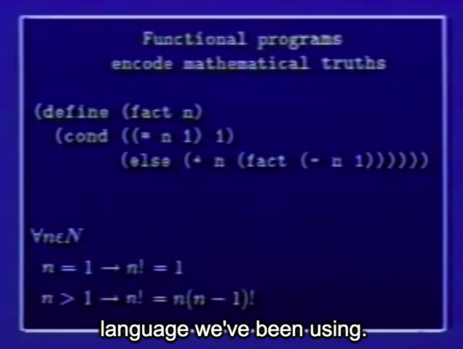

## 5A: Assignment, State, and Side-effects

Gerald Jay Sussman

### Part 1

We're going to add an assignment statement.

why should we add it?

Let me quick begin by reviewing the kind of language that we have now.

```lisp
; Functional programs
; encode mathematical truths

(define (fact n)
  (cond ((= n 1) 1)
    (else (* n (fact (- n 1))))))
```



```lisp
; Processes evolved by sunch programs
; can be understood by substitution:

(fact 4)
(* 4 (fact 3))
(* 4 (* 3 (fact 2)))
(* 4 (* 3 (* 2 (fact 1))))
(* 4 (* 3 (* 2 1)))
(* 4 (* 3 2))
(* 4 6)
24
```

```lisp
; Methods may be distinguishe by the
; choice of truths expressed:

; recursive
(define (+ n m)
  (cond ((= n 0) m)
    (else (1+ (+ (-1+ n) m)))))

; iterative
(define (+ n m)
  (cond ((= n 0) m)
    (else (+ (-1+ n) (1+ m)))))
```

And just the way you arrange those truths determine the particular process. In the way choose and arrange them determines the **process** that's evolved.

#### assignment

```lisp
(SET! <var> <value>)
```

All the other programs that we've written, that have no assignments in them, the order in which they were evaluated didn't matter. But assignment is special, it produces a moment in time.


Factorial of four, if I write fact 4, independent of what context it's in,

It's a unique map from the argument to the answer.

However, once I have assignment, that isn't true. 

```lisp
(DEFINE COUNT 1)
(DEFINE (DEMO X)
        (SET! COUNT (1+ COUNT))
        (+ X COUNT))

=> (DEMO 3)
5
=> (DEMO 3)
6
```

this is the first place where the **substitution model** isn't going to work:

The substitution model is a static phenomenon that describes things that are true and not things that change. Here, we have truths that change.

#### Play with assignment

Supposing we write down the functional version,functional meaning in the old style, of factorial by an iterative process.

```lisp
; functional version
(DEFINE (FACT N)
        (DEFINE (ITER M I)
                ; m is going to be the product that I'm accumulating
                ; i is the count
                ; i 每个循环加 1 ,直到大于 N
                (COND ((> I N) M)
                      (ELSE (ITER (* I M) (+ I 1)))))
        (ITER 1 1))
```

```lisp
; imperative version
; use assignment
(DEFINE (FACT N)
        (LET ((I 1) (M 1))
             (DEFINE (LOOP)
                     (COND ((> I N) M)
                           (ELSE 
                            (SET! M (* I M))
                            (SET! I (+ I 1))
                            (LOOP)
                            )))
             (LOOP)))
```

#### 比较两种实现:

Seems like essentially the same program, but there are some ways of making errors here that didn't exist until today.

So, as I said, **first** we need a new model of computation, and **second**, we have to be damn goodreason for doing this kind of ugly thing.

QA:

`define` is intended for setting something once the first time, for making it.

> x can't be defined twice

`let`: It sets up a context where i and m are values one and one.That context exists throughout this scope, this region of the program.

```lisp
; a perfectly understandable thing from a substitution point of view.
(LET ((var e1) (var e2))
     e3)
=>
((lambda (var1 var2)
         e3)
 e1
 e2)
; var1 , var 分别传入 e1 , e2
```

