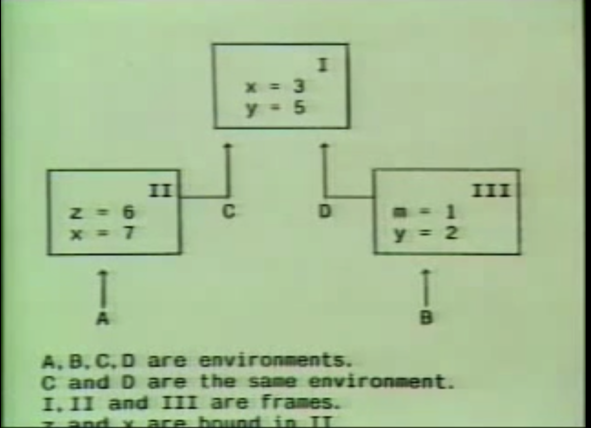
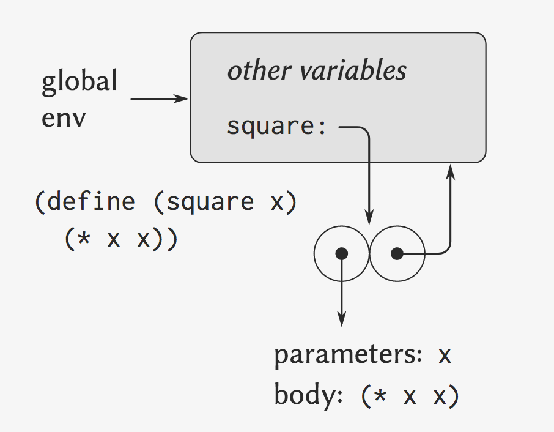
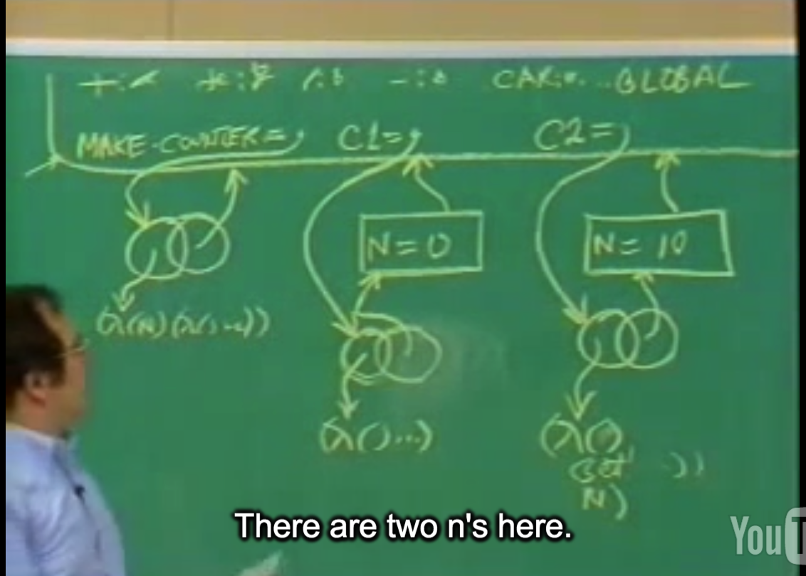
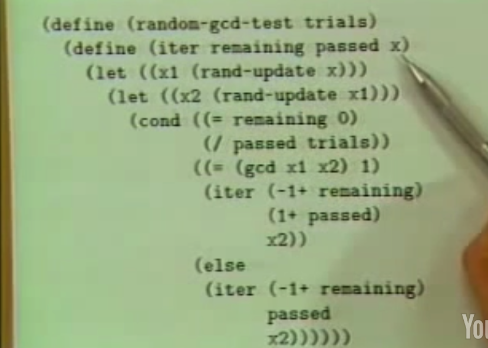

## 5A: Assignment, State, and Side-effects

Gerald Jay Sussman

### Part 1

We're going to add an assignment statement.

why should we add it?

Let me quick begin by reviewing the kind of language that we have now.

```lisp
; Functional programs
; encode mathematical truths

(define (fact n)
  (cond ((= n 1) 1)
    (else (* n (fact (- n 1))))))
```


```lisp
; Processes evolved by sunch programs
; can be understood by substitution:

(fact 4)
(* 4 (fact 3))
(* 4 (* 3 (fact 2)))
(* 4 (* 3 (* 2 (fact 1))))
(* 4 (* 3 (* 2 1)))
(* 4 (* 3 2))
(* 4 6)
24
```

```lisp
; Methods may be distinguishe by the
; choice of truths expressed:

; recursive
(define (+ n m)
  (cond ((= n 0) m)
    (else (1+ (+ (-1+ n) m)))))

; iterative
(define (+ n m)
  (cond ((= n 0) m)
    (else (+ (-1+ n) (1+ m)))))
```

And just the way you arrange those truths determine the particular process. In the way choose and arrange them determines the **process** that's evolved.

#### assignment

```lisp
(SET! <var> <value>)
```

All the other programs that we've written, that have no assignments in them, the order in which they were evaluated didn't matter. But assignment is special, it produces a moment in time.


Factorial of four, if I write fact 4, independent of what context it's in,

It's a unique map from the argument to the answer.

However, once I have assignment, that isn't true. 

```lisp
(DEFINE COUNT 1)
(DEFINE (DEMO X)
        (SET! COUNT (1+ COUNT))
        (+ X COUNT))

=> (DEMO 3)
5
=> (DEMO 3)
6
```

this is the first place where the **substitution model** isn't going to work:

The substitution model is a static phenomenon that describes things that are true and not things that change. Here, we have truths that change.

#### Play with assignment

Supposing we write down the functional version,functional meaning in the old style, of factorial by an iterative process.

```lisp
; functional version
(DEFINE (FACT N)
        (DEFINE (ITER M I)
                ; m is going to be the product that I'm accumulating
                ; i is the count
                ; i 每个循环加 1 ,直到大于 N
                (COND ((> I N) M)
                      (ELSE (ITER (* I M) (+ I 1)))))
        (ITER 1 1))
```

```lisp
; imperative version
; use assignment
(DEFINE (FACT N)
        (LET ((I 1) (M 1))
             (DEFINE (LOOP)
                     (COND ((> I N) M)
                           (ELSE 
                            (SET! M (* I M))
                            (SET! I (+ I 1))
                            (LOOP)
                            )))
             (LOOP)))
```

#### 比较两种实现:

Seems like essentially the same program, but there are some ways of making errors here that didn't exist until today.

So, as I said, **first** we need a new model of computation, and **second**, we have to be damn good reason for doing this kind of ugly thing.

QA:

`define` is intended for setting something once the first time, for making it.

> x can't be defined twice

`let`: It sets up a context where i and m are values one and one.That context exists throughout this scope, this region of the program.

```lisp
; a perfectly understandable thing from a substitution point of view.
(LET ((var e1) (var e2))
     e3)
=>
((lambda (var1 var2)
         e3)
 e1
 e2)
; var1 , var 分别传入 e1 , e2
```

### Part 2 : environment model

 environment model (当存在assignment, 不再是substitution model)

names:

#### Bound variable

(terminology 术语) (用术语表达这个词的意义)

```markdown
We say that a variable , `V`, Is *bound in an expression*, `E`,if the meaning if `E` is unchanged by uniform replacement of a variable, `W`, not occuring in `E`, for every occurring of `V` In `E`.
```


```markdown
∀x ∃y P(x, y)
This variable, x, and this variable, y, are bound, because the meaning of this expression does not depend upon the particular letters I used to describe x and y.
```

```lisp
(lambda (y) ((lambda (x) (* x y)) 3))
; the same procedure
(lambda (y) ((lambda (z) (* z y)) 3))
```

#### Free variable

```lisp
; y is not bound.
(lambda (x) (* x y))

; * is free variable
(lambda (x) ((lambda (y) (* x y)) 3))
```

#### scope

(terimnology)(获得bound variable的唯一方式就是lambda表达式)

```markdown
If `x` is a bound variable in e,then there is a lambda expression where it is bound. So the only way you can get a bound variable ultimately is by `lambda expression`.
```

And it turns out, we could always arrange things so you don't need any defines. And we'll see that in a while. It's a very magical thing. So **define** really can **go away**. The really, only thing that makes names is lambda. That's its job. And what's so amazing about a lot of things is you can compute with only **lambda**.(可以不需要`define`)

- bound variable list(lambda声明变量的地方)

a lambda expression has a place where it declares a variable. We call it the formal parameter list or the bound variable list.

- scope(其他声明部分, 是defined variable的scope)

In addition, those parts of the expression where the variable is defined, which was declared by some declaration, is called the **scope** of that variable.

> OK, well, now we have enough terminology to begin to understand how to make a new model for computation, because the key thing going on here is that we destroyed the substitution model.

渐渐进入关键内容

#### environments

An **environment** is a way of **doing substitutions virtually**. It represents a place where something is stored which is the substitutions that you haven't done. It's a place where everything accumulates, where the names of the variables are associated with the values they have such that when you say, what dose this name mean, you look it up in an environment.

So an **environment** is a function, or a table, or something like that. But it's a structured sort of table. It's **made out of** things called **frames**. Frames are pieces of environment, and they are chained together,

```markdown
如上图:
frame one, x and y are bound.
frame two, z is bound, and x is bound,and y is bound.
从A看, x is 7, frame two 中的 x **shadow**了 frame one 中的x.
```



a **procedure object**. It's a composite object consisting of **a piece of code** and a **environment structure**. (一个procedure对象由两部分组成, code和其所被定义时的env, 这时env中会有一个symbol (name)指向这个procedure object) !!!

#### evaluation new rules

The environment model of procedure application can be summarized by two rules:

- A procedure object is applied to a set of arguments by constructing a frame, binding the formal parameters of the procedure to the arguments of the **call**, and then evaluating the body of the procedure in the context of the new environment constructed. The new frame has as its enclosing environment the environment part of the procedure object being applied.
- A procedure is created by evaluating a λ-expression relative to a given environment. The resulting procedure object is a pair consisting of the text of the λ-expression and a pointer to the environment in which the procedure was created.

QA:

- the **environment** is that linked **chain of frames**

### Part 3 (47:20)

Why introduce assignment? 

with some very interesting programs that have assignment. Understand something special about them that makes them somewhat valuable.

#### Eg: make-count

```lisp
(DEFINE MAKE-COUNTER
        (lambda (N)
                (lambda()
                       (SET! N (1+ N))
                       N)))

(DEFINE C1 (MAKE-COUNTER 0))
(DEFINE C2 (MAKE-COUNTER 10))
```



use those counters

```lisp
=> (C1)
1
=> (C2)
11
=> (C1)
2
=> (C2)
12
; So what I have are computational objects.
```

比喻: 两个人(procedure)各自的state分开的, 但也有一些相互影响.

Some of my state variables, a very few of them, therefore,are coupled to yours. If you were to suddenly yell very loud, my blood pressure would go up.

#### Action and Identidy

```markdown
We say that an **aciton**, `A`. had an effect on an object, `X`.(or equivalently, that X was changed by A).if some property, P. which was true of X before A because false of X after A.

We say that two ocjects, X and Y, are the same if any action which has an effect on X has the same effect on Y.
```

简言之:

Action: 能使对象的某一属性改变, 在Action发生前后.

Identity: 同一Action对两个Object影响一致.

The **modularity** of the world can give us the modularity in our programming. So we invent things called **object-oriented programming** and things like that to provide us with that power.

Eg:

```lisp
;;; Cesaro's method for estimating Pi:
;;;   Prob(gcd(n1,n2)=1) = 6/(Pi*Pi)

(define (estimate-pi n)
  (sqrt (/ 6 (monte-carlo n cesaro))))

(define (cesaro)
  (= (gcd (rand) (rand)) 1))

; trials is the number 做几次实验
(define (monte-carlo trials experiment)
  (define (iter remaining passed)
    (cond ((= remaining 0)
           (/ passed trials))
      ((experiment)
       ; 实验成功
       (iter (-1+ remaining)
             (1+ passed)))
      ; 未成功
      (else
       (iter (-1+ remaining)
             passd))))
  (iter trials 0))


;random number generator
(define rand
  (let ((x random-init))
       (lambda ()
               ; Knuth's book.(高德纳)
               (set! x (rand-update x))
               x)))
```

Supposing, I didn't want to useassignments. Supposing, I wanted to write this program without assignments. What problemswould I have?



> You see what's happened here is that the state of the random number generator is no longer confined to the insides of the random number generator. It has **leaked out**. It has leaked out into my procedure that does the Monte Carlo experiment. But what's worse than that, is it's also,because it was contained inside my experiment itself, Cesaro, it leaked out of that too. 

Wouldn't it be nice if assignment was a good thing and maybe it's worth it, but I'm not sure.

```lisp

"Things are seldom what they see, Skim milk masquerades as cream..."
Gilber and Sullivan
(H.M.S Pinafore)
```

QA:

No ques.