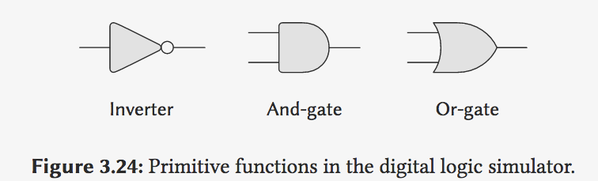
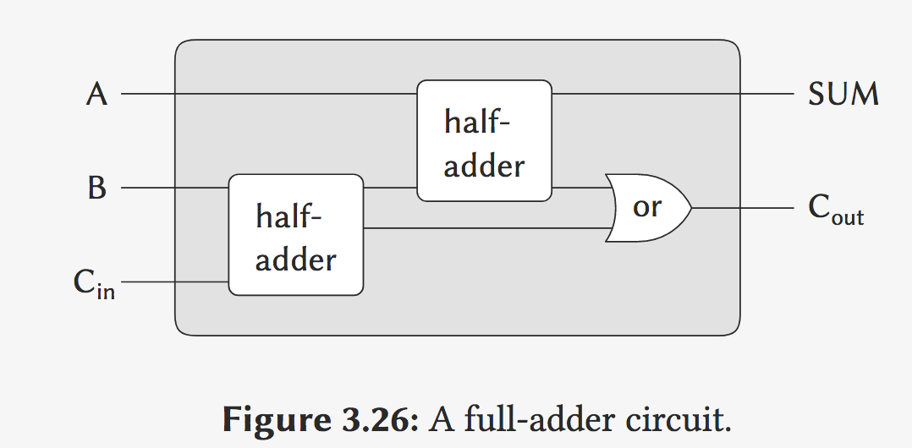
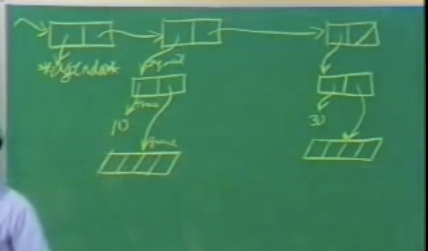
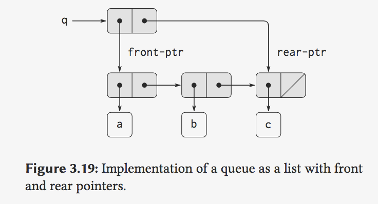

## 5B: Computational Objects

Gerald Jay Sussman

### Part 1 event-driven simulation (digital circuit)

引子:

And what I want to make is a correspondence between the objects in the world and the objects in the computer,

modularity

Well, let's take the best kind of objects I know. They're completely--they're completely wonderful:`electrical systems`.



```lisp
; Primitives and Means of Combination

(define a (make-wire))
(define b (make-wire))
(define c (make-wire))
(define d (make-wire))
(define e (make-wire))
(define s (make-wire))

; or-get inputs: a, b; outputs: d.
(or-gate a b d)
(and-gate a b c)
(inverter c e)
(and-gate)
```

So today what I'm going to show you, right now, we're going to build up an invented language in Lisp,


半加器: S is sum, C is carry(进位).

```lisp
(define (half-adder a b s c)
  (let ((d (make-wire)) (e (make-wire)))
       (or-gate a b d)
       (and-gate a b c)
       (inverter c e)
       (and-gate d e s)
       'ok))
```

And the nice thing about this that I've just shown you is **this language** is hierarchical in the right way. If a language isn't hierarchical in the right way, if it turns out that a compound object doesn't look like a primitive, there's something wrong with the language-- at least the way I feel about that.


 instead of starting with mathematical functions,

we are starting with things that are electrical objects

And the glue we're using is basically the Lisp structure: **lambdas**.

```lisp
(define (full-adder a b c-in sum c-out)
  (let ((c1 (make-wire)) 
        (c2 (make-wire))
        (s  (make-wire)))
    (half-adder b c-in s c1)
    (half-adder a s sum c2)
    (or-gate c1 c2 c-out)
    'ok))
```



Let's look at the primitives.(只需实现`primitive`) The only problem is we have to implement the primitives. Nothing else has to be implemented, because we're picking up the means of combination and abstraction from Lisp, inheriting them in the **embedding**.

#### Inverter (Primitive)

```lisp
; 非门
(define (inverter input output)
  (define (invert-input)
    (let ((new-value 
           (logical-not (get-signal input))))
         ; 经过一定的延迟(延迟时间是inverter-delay)
      (after-delay 
       inverter-delay
       (lambda ()
         (set-signal! output new-value)))))
  ; 给input wire添加一个action(called invert-input)
  (add-action! input invert-input)
  'ok)

(define (logical-not s)
  (cond ((= s 0) 1)
        ((= s 1) 0)
        (else (error "Invalid signal" s))))
```

```lisp
; 与门
(define (and-gate a1 a2 output)
  (define (and-action-procedure)
    (let ((new-value
           (logical-and (get-signal a1) 
                        (get-signal a2))))
      (after-delay 
       and-gate-delay
       (lambda ()
         (set-signal! output new-value)))))
  (add-action! a1 and-action-procedure)
  (add-action! a2 and-action-procedure)
  'ok)
```

Now supposing I were to try to say what's the computational model.

#### Computational Model

```lisp
; wire
(define (make-wire)
  (let ((signal-value 0) 
        (action-procedures '()))
    (define (set-my-signal! new-value)
      (if (not (= signal-value new-value))
          (begin (set! signal-value new-value)
                 (call-each 
                  action-procedures))
          'done))
    (define (accept-action-procedure! proc)
      (set! action-procedures 
            (cons proc action-procedures))
      (proc))
    (define (dispatch m)
      (cond ((eq? m 'get-signal) 
             signal-value)
            ((eq? m 'set-signal!) 
             set-my-signal!)
            ((eq? m 'add-action!) 
             accept-action-procedure!)
            (else (error "Unknown operation: 
                          WIRE" m))))
    dispatch))
```

The local procedure `set-my-signal!` tests whether the new signal value changes the signal on the wire. If so, it runs each of the action procedures, using the following procedure `call-each`, which calls each of the items in a list of no-argument procedures: (如果value更新, 发起通知)

```lisp
(define (call-each procedures)
  (if (null? procedures)
      'done
      (begin ((car procedures))
             (call-each (cdr procedures)))))

(define (get-signal wire)
  (wire 'get-signal))

(define (set-signal! wire new-value)
  ((wire 'set-signal!) new-value))

(define (add-action! wire action-procedure)
  ((wire 'add-action!) action-procedure))
```

The **wire** is the **dispatch** returned by creating the wire. It's a **procedure**.

- delay

```lisp
(define (after-delay delay action)
  (add-to-agenda! 
   (+ delay (current-time the-agenda))
   action
   the-agenda))

; `propagate`, which is the way things run. 
(define (propagate)
  (if (empty-agenda? the-agenda)
      'done
      (let ((first-item 
             (first-agenda-item the-agenda)))
        (first-item)
        (remove-first-agenda-item! the-agenda)
        (propagate))))
```

##### A sample simulation

The probe tells the wire that, whenever its signal changes value, it should **print** the **new signal value**, together with the **current time** and a **name** that identifies the wire:

```lisp
(define (probe name wire)
  (add-action! 
   wire
   (lambda ()
     (newline)
     (display name)
     (display " ")
     (display (current-time the-agenda))
     (display "  New-value = ")
     (display (get-signal wire)))))
```

#### half-adder example

```lisp
(half-adder input-1 input-2 sum carry)
ok

(set-signal! input-1 1)
done

(propagate)
sum 8  New-value = 1
done

(set-signal! input-2 1)
done

(propagate)
carry 11  New-value = 1
sum 16  New-value = 0
done
```

And how you might organize it to have nice **hierarchical structure** allowing you to build abstract boxes that you can instantiate. But I haven't told you any of the details about how this agenda and things like that work. That we'll do **next**. And that's going to involve change and **mutation of data** and things like that.

### Part 2 Agenda

Right now I want to show you a way of organizing time, which is an agenda or priority queue,

*agenda*, that contains a schedule of things to do. The following operations are defined for agendas:

- `(make-agenda)` returns a new empty agenda.
- `(empty-agenda? ⟨agenda⟩)` is true if the specified agenda is empty.
- `(first-agenda-item ⟨agenda⟩)` returns the first item on the agenda.
- `(remove-first-agenda-item! ⟨agenda⟩)` modifies the agenda by removing the first item.
- `(add-to-agenda! ⟨time⟩ ⟨action⟩ ⟨agenda⟩)` modifies the agenda by adding the given action procedure to be run at the specified time.
- `(current-time ⟨agenda⟩)` returns the current simulation time.


#### implementing the agenda

agenda data structure:

The agenda is made up of *time segments*. Each time segment is a pair consisting of a number (the time) and a queue(that holds the procedures that are scheduled to be run during that time segment.)

#### queue

primitive and operation

```lisp
; one constructor:
(make-queue) => <new queue>

; two selectors:
(empty-queue? ⟨queue⟩)
(front-queue ⟨queue⟩)

; two mutators:
(insert-queue! ⟨queue⟩ ⟨item⟩)
(delete-queue! ⟨queue⟩)
```



有一个`rear pointer`方便在queue后增加元素, without chase down from beginning.

```lisp
; 改变一个pair中 car pointer 的指向.
(SET-CAR! <pair> <value>)
(SET-CDR! <pair> <value>)
```

### Part 3:

original axioms about `CONS`:

```lisp
∀x,y (car (cons x y)) = x
     (cdr (cons x y)) = y
```

cons是两个元素, 得出来的结果 是一样的吗?

#### identity & share:

```lisp
(define a (cons 1 2))
(define b (cons a a))
; (cons 1 2) 有三个pointer, a ,(car b) , (cdr b)
(set-car! (car b) 3)
=>(car b)
3
=>(cdar b)
3
```

#### Definition of CONS

 I'm going to show you even a more horrible thing, a definition of CONS in terms of nothing but air, hot air.

```lisp
(DEFINE (CONS X Y)
        (lambda(M) (M X Y)))
;This [? idea ?] was invented by Alonzo Church, who was the greatest programmer of the 20th century, 

(DEFINE (CAR X)
        (X (lambda(A D) A)))

(DEFINE (CDR X)
        (X (lambda(A D) D)))
```

example:

```lisp
(car (cons 35 47))
(car (lambda(M) (M 35 47)))
((lambda(M)(M 35 47))(lambda(A D) A))
((lambda(A D) A) 35 47)
35
; So I don't need any data at all, not even numbers. This is Alonso Church's `hack`.
```

### "Lambda Calculus" Mutable Data

I'm going to change the definition of CONS

```lisp
(define (cons x y)
  (lambda (m)
          (m x
             y
             ; permission 传给 m
             (lambda (n) (set! x n))
             (lambda (n) (set! y n))
             )))
; cons 返回一个接受4个parameter的procedure

(define (car x)
  (x (lambda (a d sa sd) a)))

(define (cdr x)
  (x (lambda (a d sa sd) d)))

; exciting part
(define (set-car! x y)
  ; 我理解错了, sa是一个procedure
  ; (x (lambda (a d sa sd) (set! sa y))))
  (x (lambda (a d sa sd) (sa y)))

(define (set-cdr! x y)
  (x (lambda (a d sa sd) (sd y))))
```

这里有一个bug, 当调用`car`(或者其他任一个operation时), 原来的 cons组成的pair就失效了.

QA: (这堂课只有Part 3有QA)

- 个人理解 `cons`返回的new pair (a procedure), 把设置其内部属性的方法(set 方法), 暴露给了传入的Procedure的 第3、4个参数。

