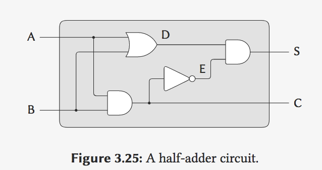

## 5B: Computational Objects

Gerald Jay Sussman

### Part 1

引子:

And what I want to make is a correspondence betweenthe objects in the world and the objects in the computer,

modularity

Well, let's take the best kind of objects I know. They're completely--they're completely wonderful:`electrical systems`.


```lisp
; Primitives and Means of Combination

(define a (make-wire))
(define b (make-wire))
(define c (make-wire))
(define d (make-wire))
(define e (make-wire))
(define s (make-wire))

; or-get inputs: a, b; outputs: d.
(or-gate a b d)
(and-gate a b c)
(inverter c e)
(and-gate)
```

So today what I'm going to show you, right now, we're going to build up an invented language in Lisp,



半加器: S is sum, C is carry(进位).

```lisp
(define (half-adder a b s c)
  (let ((d (make-wire)) (e (make-wire)))
       (or-gate a b d)
       (and-gate a b c)
       (inverter c e)
       (and-gate d e s)
       'ok))
```

And the nice thing about this that I've just shown you is **this language** is hierarchical in the right way. If a language isn't hierarchical in the right way, if it turns out that a compound object doesn't look like a primitive, there's something wrong with the language-- at least the way I feel about that.