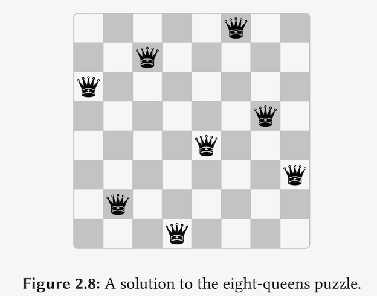

## Streams, Part 1

Hal Abelson

### Part 1:

```markdown
ASSIGNMENT
STATE
CHANGE
TIME
IDENTITY
OBJECT
SHARING
```

So all of these things enter as soon as we introduce assignment.

Well, how'd we get into this mess? Remember what we did, the reason we got into this is because we were looking to build modular systems.(我们是如何遇到这些问题的, 因为我们在建立`Modularity` System)

we'd like our program to break into natural pieces, pieces that mirror the parts of the system that we see in the real world.(把程序的各个pirces对应到real world中)

#### 我们的view错了?

See, maybe the real reason that we pay such a price to write programs that mirror our view ofreality is that we have the wrong view of reality.

#### Stream Processing

Well, today we're going to look at **another way to decompose systems** that's more like the **signal processing** engineer's view of the world than it is like thinking about objects that communicate sending messages. That's called **stream processing**.

example:

```lisp
(define (sum-odd-squares tree)
  (if (leaf-node? tree)
      (if (odd? tree)
          (square tree)
          0)
      (+ (sum-odd-squares
          (left-branch tree))
         (sum-odd-squares
          (right-branch tree)))))
```

```lisp
(define (odd-fibs n)
  (define (next k)
    (if (> k n)
        '()
        (let ((f (fib k)))
             (if (odd? f)
                 (cons f (next (1+ k)))
                 (next (1+ k))))))
  (next 1))
```

So if I was talking like a signal processing engineer, what I might say is that the first procedure enumerates the leaves of a tree.


#### 问题根源: 

> Going back to this fundamental principle of computer science that in order to control something, you need the name of it, we don't really have control over thinking about things this way because we don't have our hands in them explicitly.

我们没有合理的描述成上图的方式, program 把 `enum` , `acc`等混合在了一起.

Well, let's invent an appropriate language in which we can build these pieces.

The key to the language is `signal`.

data structures called streams.

#### stream

constructor & selector:

```lisp
(cons-stream x y)

; 课程里selector是 (HEAD s) (TAIL s)
(stream-car (cons-stream x y)) = x
(stream-cdr (cons-stream x y)) = y
```

why don't you just pretend that streams really are just a terminology for lists. And we'll see in a little while why we want to keep this extra abstraction layer and not just call them lists.(为什么不直接用list 来表示stream , 一会解释)

```lisp
(define (map-stream proc s)
  (if (empty-stream? s
      the-empty-stream
      (cons-stream
       (proc (head s))
       (map-stream proc (tail s)))))
```

filter box:

```lisp
; predicate
(define (filter pred s)
  (cond
    ((empty-stream? s) the-empty-stream)
    ((pred (head s))
     (cons-stream (head s)
                  (filter pred
                          (tail s))))
    (else (filter pred (tail s)))))
```

accumulate

```lisp
(define (accumulate combiner init-val s)
  (if (empty-stream? s)
      init-val
      (combiner (head s)
                (accumulate combiner
                            init-val
                            (tail s)))))
```

enumerate:

```lisp
(define (enumerate-tree tree)
  (if (leaf-node? tree)
      (cons-stream tree
                   the-empty-stream)
      (append-streams
       (enumerate-tree
        (left-branch tree))
       (enumerate-tree
        (right-branch tree)))))
```

append-stream:

```lisp
(define (append-streams s1 s2)
  (if (empty-stream? s1)
      s2
      (cons-stream
       (head s1)
       (append-streams (tail s1)
                       s2))))
```

enumerate interval

```lisp
(define (enum-interval low high)
  (if (> low high)
      the-empty-streams
      (cons-stream
       low
       (enum-interval (1+ low) high))))
```

用Stream来表示之前original procedure for summing the odd squares in a tree.

```lisp
(define (sum-odd-squares tree)
  (accumulate
   +
   0
   (map
    square
    (filter odd
            (enumerate-tree tree)))))
```

fibs

```lisp
(define (odd-fibs n)
  (accumulate
   cons
   '()
   (filter
    odd
    (map fib (enum-interval 1 n)))))
```

the **advantage** of this stream processing is: we're establishing **conventional interfaces** that allow us to glue things together.

And as an example of that, Richard Waters, who was at MIT when he was a graduate student, as part of his thesis research went and analyzed a large chunk of the IBM scientific subroutine library, and discovered that about **60%** of the programs in it could be expressed exactly in terms using **no more than what we've put here--map, filter, and accumulate**.

QA:

### Part 2:

#### flatten (在2nd 2.2.3节)

So I've got a stream. And each element of the stream is itself a stream.

```lisp
(DEFINE (FLATTERN ST-OF-ST)
        (ACCUMULATE (APPEND-STREAMS
                     THE-EMPTY-STREAM
                     ST-OF-ST)))

; s is a stream of element
; f is a function for each element in stream
(DEFINE (FLAT-MAP F S)
        ; Each time I apply f to an element of s, I get a stream.
        (FLATTEN (MAP F S)))
```

#### Integer Pairs with Prime Sum

Given an integer *n*, find all pairs of integer *0 < j < i <= n* such as *i+j* is prime.

```markdown
n = 6
i    j    i+j
-------------
2    1    3
3    2    5
4    1    5
```

```lisp
(flatmap
 (lambda (i)
         (map
          (lambda (j) (list i j))
          (enum-interval 1 (-1+ i))))
 (enum-interval 1 n))
```


```lisp
(filter
 (lambda (p)
         ; i is the first thing in the list
         ; j is second. (j 表达有误? cdr p ?)
         ; 老师写的是正确的, p 这里是一个list.
         (prime? (+ (car p) (cadr p))))
 (flatmap ...))
```

```lisp
(define (prime-sum-pairs n)
  (map
   (lambda (p)
           ; i、j、i+j
           (list (car p)
                 (cadr p)
                 (+ (car p) (cadr p))))
   ; 上一个框
   (filter ...)))
```

总结: So there's an example which illustrates the general point that **nested loops** in this procedure startlooking like compositions of flatmaps of flatmaps of flatmaps of maps and things.

- 不足: Of course, it's pretty awful to keep writing these flatmaps of flatmaps of flatmaps. Prime-sum-pairs you saw looked **fairly complicated**,
- 改进: syntactic sugar that's called **collect**.

用collect的写法:

```lisp
(define (prime-sum-pairs n)
  (collect
   (list i j (+ i j))
   ((i (enum-interval 1 n))
    (j (enum-interval 1 (-1+ i))))
   (prime? (+ i j))))
```

#### eight-queens 问题



(没有两个在同行,行列,或者对角线)

**backtracking** computer algorithms:

在一个节点搜索所有可能, 如果没有, 放弃, 回到上一层继续搜索.

AI Back-tracking Search

Why is it complicated? Its because somehow this program is too inordinately concerned with time.It's too much-- I try this one, and I try this one, and I go back to the last possibility. And that's a complicated thing. If I stop worrying about time so much, then there's a much **simpler way** to describe this.It says, let's imagine that I have in my hands the tree down to k minus 1 levels.

So instead of thinking about this tree as generated step by step, suppose I had it all there. And to extend it from level k minus 1 to level k, I just need to extend each thing in all possible waysand only keep the ones that are safe. And that will give me the tree to level k. And that's a **recursive** strategy for solving the eight queens problem.

(与之前搜索不同的是, 假设整个tree我们已经拥有了, 然后逐层下降, 筛选出safe的可能.运用recursive的方式.)

```lisp
(define (queens size)
  (define (fill-cols k)
    (if
     (= k 0)
     (singleton empty-board)
     (collect ...)))
  (fill-cols size))
```

40:44

```lisp
(collect
 (adjoin-position try-row
                  k
                  rest-queens)
 ((rest-queens (fill-cols (-1+ k)))
  (try-row (enum-interval 1 size)))
 (safe? try-row k rest-queens))
```

When you're done, you have a stream. And the elements of that streamare all possible ways of solving that problem.

#### 重点: Change View!

We've changed our view. Remember, that's where we started today. We've changed our view ofwhat it is we're trying to model. we stop modeling things that evolve in time and have steps andhave state. And instead, we're trying to model this **global thing** like the whole flight of the chalk,rather than its state at each instant. Any questions?

QA: 

- And it seems that if you have a large enough area to search, that the second is going to become impossible.
  - 答案是后面课程的内容.

### Part 3:

Can it possibly be that computer scientists are so obtuse that they don't notice that if you'd merely did this thing, then you can get this great programming elegance?

```lisp
;;; find the second prime between
;;; 10,000 and 1,000,000

(car (cdr 
      (filter 
       prime?
       (enumerate-interval 10000 1000000))))
```

The trick is how to make it. We want to arrange for a stream to be a **data structure** that computes itself **incrementally**, an on-demand data structure.(实现stream, 一种按需增加的数据)

```lisp
(cons-stream x y)
; abbreviation for:
(cons x (delay y))
(head s) -> (car s)
(tail s) -> (force (cdr s))
```

#### promise

What delay does is take an expression and produce a **promise** to compute that expression when you ask for it.

```lisp
(head (tail (filter prime? (E-I 10,000 1,000,000))))
; (E-I 10000 1000000) -> (CONS 10000 (DELAY (E-I 10001 1000000)))
```

#### delay & force

```lisp
(delay <exp>) ; abbreviation for (lambda () exp)

(force p) = (p) ; just run it.
```

And the thing that delay did for us wasto de-couple the apparent order of events in our programs from the actual order of events that happened in the machine. That's really what **delay** is doing.

We **de-couple** the **apparent order** of events in our programs from the **actual order** of events inthe computer.


and I don't have to re-compute each tail every time I get the next tail.So there's one little hack to slightly change what delay is `memo-proce`

```lisp
(define (memo-proc proc)
  (let ((already-run? false) (result false))
    (lambda ()
      (if (not already-run?)
          (begin (set! result (proc))
                 (set! already-run? true)
                 result)
          result))))
```

`Delay` is then defined so that `(delay ⟨exp⟩)` is equivalent to

```
(memo-proc (lambda () ⟨exp⟩))
```
QA:

But the point is, once I've found the tail of the stream, to get the tail of the tail, I shouldn'thave had to **re-compute** the first tail. See, and if I didn't use memo-proc, that re-computationwould have been done.


