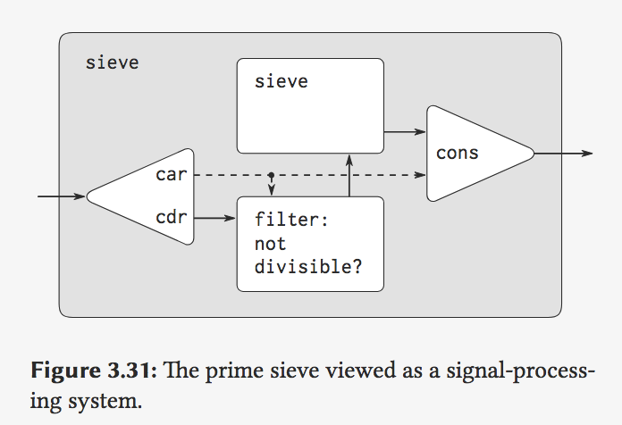
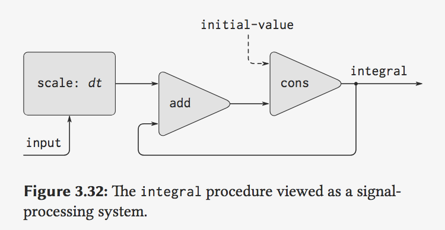
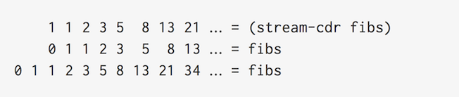
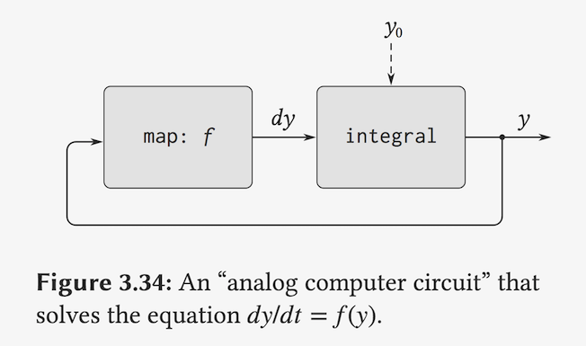
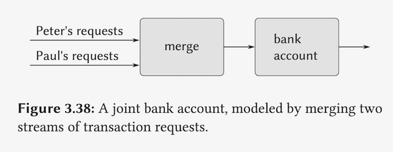

## 6B: Streams, Part 2

Hal Abelson

### Part 1: Infinite Streams

回顾:

- **decouple** the apparent order of eventsin our programs from the actual order of events in the computer.
- we can start dealing with very long streams and only having to generate the elements **on demand**.

compute the n-th element in the stream:

```lisp
(define (nth-stream n s)
  (if (= n 0)
      (head s)
      (nth-stream (-1+ n) (tail s))))
```

print stream:

```lisp
(define (print-stream s)
  (cond ((empty-stream? s) *done*)
        (else (print (head s))
              (print-stream (tail s)))))
```

#### Infinite Stream

```lisp
(define (integers-from n)
  (cons-stream n (integers-from (+1 n))))

(define integers (integers-from 1))

(nth-stream integers 20)
; => 21

; 2nd
(define (divisible? x y) (= (remainder x y) 0))
(define no-sevens
  (stream-filter (lambda (x) 
                   (not (divisible? x 7)))
                 integers))

; 等同于 nth-stream
(stream-ref no-sevens 100)
; => 117
```


#### sieve of Eratosthenes

For a look at a more exciting infinite stream, we can generalize the `no-sevens` example to construct the infinite stream of prime numbers, using a method known as the *sieve of Eratosthenes*.

(没找到一个prime, 就把能被它整除的数, 从rest stream中去除.)

```lisp
(define (sieve stream)
  (cons-stream
   (stream-car stream)
   (sieve (stream-filter
           ; 把能被(stream-car stream)整除的元素从
           ; rest stream中filter
           (lambda (x)
             (not (divisible? 
                   x (stream-car stream))))
           (stream-cdr stream)))))

(define primes 
  (sieve (integers-starting-from 2)))

(stream-ref primes 50)
; => 233
```

shown in the “Henderson diagram”



not only is the stream infinite, but the **signal processor** is also **infinite**, because the sieve contains a sieve within it.

QA: No Ques.

### Part 2: implicitly Infinite Stream and Delayed Evaluation(*)

There's another way to think about stream processing, and that's to focus not on programs that sort of **process** these elements as you walk down the stream, but on things that kind of process the streams **all at once**.

```lisp
(define (add-streams s1 s2)
  (cond ((empty-stream? s1) s2)
        ((empty-stream? s2) s1)
        (else
          (cons-stream
            (+ (head s1) (head s2))
            (add-streams (tail s1) (tail s2))))))

(define (scale-stream c s)
  (map-stream (lambda (x) (* x c)) s))
```

#### Defining streams implicitly

integers above 是通过 "generating" procedure 显式定义的.

So given those two, let me show you what I mean by programs that operate on streams all at once.

```lisp
(deifne ones (cons-stream 1 ones))

(define integers
  (cons-stream 1
               (add-streams integers ones)))
```

See, notice that it works because of **delay**.(能这么定义是因为delay)

```lisp
(define ones (cons 1 (delay ones)))
```

at the point I do this definition, `ones` isn't defined. Having run the `definition` now, ones is defined.(delay 运行时 `ones`已经被定义了)

the “implicit style” definition of the stream of integers

```lisp
(define (integral s initial-value dt)
  (define int
    (cons-stream 
     initial-value
     (add-streams (scale-stream dt s)
                  int)))
  int)
```


OK, let me draw a picture of that integers thing because it still may be seems a little bit **shaky**



#### Fib

```lisp
(define fibs
  (cons-stream 0
    (cons-stream 1
      (add-stream fibs (tail fibs)))))
```

How does that work? (`tail`is `stream-cdr`)



Instead of thinking that recursive procedures, we have **recursively defined** data objects.

there's no difference really between procedures and data

#### Streams and Delayed Evaluation (重点)

课程里使用`y'=y*y, y(0)=1`举例, 即此处`f(y)=y*y`



尝试写出上图对应的procedure:

```lisp
(define (solve f y0 dt)
  (define y (integral dy y0 dt))
  (define dy (stream-map f y))
  y)
```

思考: why `ones` work?

See, if I say this is cons-stream of 1 onto something without knowing anything about something, I know that the stream starts off with 1. That's why it was sensible to build somethinglike cons-stream.

Anthor version of `integral` (expect the integrand stream to be a *delayed argument*.)

```lisp
(define (integral delay-s
                  initial-value
                  dt)
  (define int
    (cons-stream
     initial-value
     (let ((s (force delay-s)))
          (add-streams (scale-stream dt s)
                       int))))
  int)
```

所以上述 `solve` procedure 可以写成:

```lisp
(define (solve f y0 dt)
  (define y (integral (delay dy) y0 dt))
  (define dy (stream-map f y))
  y)
```

### Part 3:

#### 回顾

Well, just before the break, I'm not sure if you noticed it, but something nasty started to happen.We've been going along with the streams and divorcing **time** in the programs from time in the computers, and all that divorcing got hidden inside the streams. And then at the very end, we saw that sometimes in order to really take advantage of this method, you have to pull out other delays. You have to write some **explicit delays** that are not hidden inside that cons-stream.

#### 提出问题 (所有的args都变成promise)

but if you have some very complicated system with all kinds of self-loops, it becomes very, very **difficult** to see where you need those delays. And if you leave them out by **mistake**, it becomes very, very difficult to see why the thing maybe isn't working.

We could change the language so that **all procedures** acted like cons-stream, so that every procedure automatically has an **implicit delay** around its **arguments**. 

`Normal-order Evaluation` VS. `Applicativ-order`

And remember the **substitution model** for `applicative order`.

- It says when you go and evaluate a combination, you find the values of all the pieces.

**Normal order**:

- just put a promise to compute them there.
- **never** really simplify anything **until** you get down to a primitive operator.

why don't we do that? Because if we did, we'd get all the advantages of delayed evaluationwith none of the mess.

- that would make cons the same as cons-stream
- We wouldn't need streams of all because lists would automatically be streams. (不在需要stream, 以为已经都是stream)

`Miranda` language

#### 这么做是有代价的:

But there's a price.

Remember whatwe're trying to do. We're trying to think about **programming** as **a way to specify processes**. And if we give up too much time, our language becomes **more elegant**, but it becomes a little bit **less expressive**.There are certain distinctions that we can't draw.

1. for example:

```lisp
(define (factorial n)
  (define (iter product counter)
    (if (> counter n)
        product
        (iter (* counter product)
              (+ counter 1))))
  (iter 1 1))
```

So one of the disadvantages is that you can't really express iteration.

people who are trying to write real operating systems in these languages are running into exactly these types of problems.

 And one of the research questions in these kinds of languages are figuring out the right compiler technology to get rid of the so-called **dragging tails**. It's not simple.(类似于js的`callback hell`, `promise`太长导致的问题.)

2. side effects just don't mix.

e.g.:

```lisp
(define x 0)

(define (id n)
  (set! x n)
  n)

(define (inc a) (1+ a))
```

```lisp
(define y (inc (id 3)))

; x ---> 0 , because y is a promise not run. x is the init-value

; y ---> 4 , loop up y ,cause the identity func to be run

; x ---> 3 , after fun run
```

But it's very confusing for a very deep reason, which is that the whole idea ofputting in delays is that you throw away **time**.

what is it that you'retrying to model and how do you look at the world.

purely **functional language** is one that just doesn't have anyside effects.The price is you **give up** assignment. 

So remember Jerry's random number generator. We wanted to package that stated **modularly**.

banking system, **message-processing** view. Also can use **stream** view.

```lisp
(define (make-deposit-account
         balance deposit-stream)
  (cons-stream
   balance
   (make-deposit-account
    (+ balance (head deposit-stream))
    (tail deposit-stream))))
```

So there's sort of a very typical **message-passing**, object-oriented thing that's done without side effects at all. There are very many things you can do this way.


Can everybody go over to purely **functional languages**? Well, we don't know, but there seem to be places where purely functional programming **breaks down**.

fair merge



So one of the other active researcher areas in **functional languages** is inventing little things like **fair merge** and maybe some others,which will take the places where I used to need side effects and objects and sort of hide them away in some very well-defined modules of the system so that *all the problems of assignment don't sort of leak out all over the system but are captured in some fairly well-understood things.*


More generally, I think what you're seeing is that we're running across what I think is a very basic problem in computer science, which is `how to define languages that somehow can talk aboutdelayed evaluation`, but also be able to `reflect this view that there are objects in the world`.


