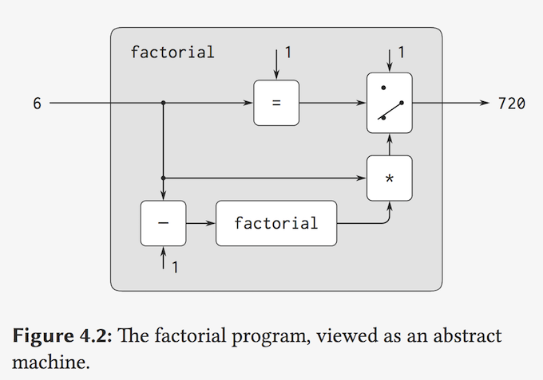
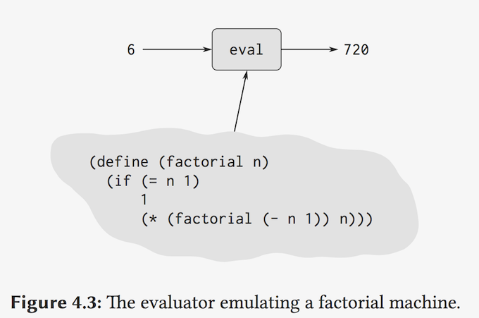
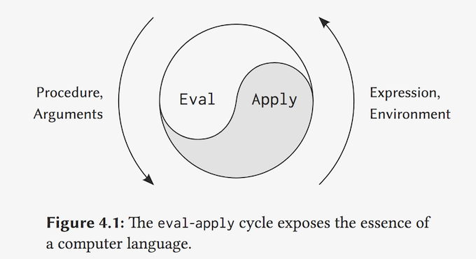
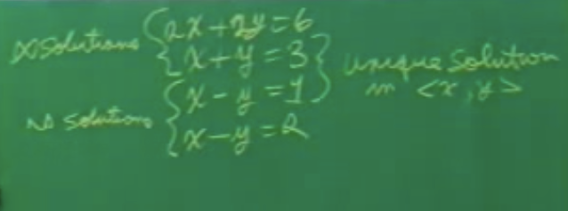

## 7A: Metacircular Evaluator, Part 1

Jay Sussman

### Part 1:

#### fact

```lisp
(define (factorial n)
  (if (= n 1)
      1
      (* (factorial (- n 1)) n)))
```



#### universal machine



For example, if we feed our evaluator the definition of `factorial`, as shown in Figure 4.3, the evaluator will be able to compute factorials.

From this perspective, our evaluator is seen to be a *universal machine*.

#### evaluator for Lisp(老师穿上jacket and 戴上hat) 4.1.1

```lisp
(define eval
  (lambda (exp env)                            ;; env is a dictionary mapping symbols to values
    (cond
      ;; SPECIAL FORMS
      ;; 3 -> 3
      ((number? exp) exp)
      ;; x -> 3 or car -> [procedure]
      ((symbol? exp) (lookup exp env))
      ;; 'foo == (quote foo) -> foo
      ((eq? (car exp) 'quote) (cadr exp))
      ;; (lambda x) (+ x y) -> (closure ((x) (+ x y)) env)  bound variables + body + env
      ((eq? (car exp) 'lambda) (list 'CLOSURE (cdr exp) env))
      ;; (cond (p1 e1) (p2 e2) ...) ->
      ((eq? (car exp) 'cond) (evcond (cdr exp) env))
      ;; (+ x 3) -> default, general application
      ;; DEFAULT COMBINATION
      (else
               ;; operator
        (apply (eval (car exp) env)
               ;; operands
               (evlist (cdr exp) env))))))
```

Now the **environment** is a dictionary which maps the symbol names to their values. And that's all it is.(`env`就是一个 symbol -> value的 map)

The number of **reserve words** that should exist in a language should be no more than a person could remember on his fingers and toes.

#### Apply

**apply's job** is to take a procedure and apply it to its arguments after both have been evaluated

to **come up with** a procedure and the arguments **rather** the operator symbols and the operand symbols,whatever they are-- symbolic expressions.

```lisp
(define apply
  (lambda (proc args)
          (cond
            ((primitive? proc) (apply-primop proc args))
            ((eq? (car proc) 'CLOSURE) 
             ; get the body
             (eval (cadadr proc)
                   (bind caadr proc)
                   args
                   (cadadr proc)))
            ; compiled code ? (可以加在这里)
            (else error)
            )))
```

`BIND` will be interesting later.

#### Evlist

When `eval` processes a procedure application, it uses `list-of-values`to produce the list of arguments to which the procedure is to be applied. `List-of-values` takes as an argument the operands of the combination. It evaluates each operand and returns a list of the corresponding values:(2nd)

```
(define (list-of-values exps env)
  (if (no-operands? exps)
      '()
      (cons (eval (first-operand exps) env)
            (list-of-values 
             (rest-operands exps) 
             env))))
```

#### Conditionals

```lisp
(define evcond
  (lambda (clauses env)
          (cond ((eq? clauses '()) '())
            ; clauses eg: ((p1 e1) (p2 e2))
            ; each clause is a list. And so the predicate part is the CAAR of the clauses.
            ((eq? (caar clauses) 'ELSE)
             ; So this is the first clause, the second element of it,
             (eval (cadar clauses) env))
            ; first clauses is false, do the next.
            ((false? (eval (caar clauses) env))
             (evcond (cdr clauses) env))
            ; true
            (else
             (eval (cadar clauses) env))
            )))
```

#### bind

> So given an existing environment structure, I'm going to make a new environment structure by consing a new frame onto the existing environment structure,where the new frame consists of the result of pairing up the variables, which are the bound variables of the procedure I'm applying, to the values which are the arguments that were passed that procedure.

```lisp
(define bind
  (lambda (vars vals env)
          (cons (pair-up vars vals)
                env)))
```

pair-up

> This is just making a list, adding a new element to our list of frames, which is an environment structure, to make a new environment. Where pair-up is very simple. 

```lisp
(define pair-up
  ; Pair-up is nothing morethan if I have a list of variables and a list of values, well, 
  (lambda (vars vals)
          (cond
            ((eq? vars '())
             ; if I run out of variables and if I run out of values, everything's OK. Otherwise, I've given too many arguments.
             (cond ((eq? vals '()) '())
               ; too many arguments
               (else (error TMA))))
            ; If I've not run out of variables, but I've run out of values, that I have too few arguments.
            ((eq? vals '()) (error TFA))
            (else
             (cons (cons (car vars)
                         (car vals))
                   (pair-up (cdr vars)
                            (cdr vals)))))))
```

#### lookup

```lisp
(define lookup
  (lambda (sym env)
          ; If I have to look up a symbol in an environment, well, if the environment is empty, then I've got an unbound variable.
          (cond ((eq? env '()) (error UBV))
            ; Otherwise, what I'm going to do is usea special pair list lookup procedure, which we'll have very shortly, of the symbol in the first frame of the environment.
            (else
             ((lambda (vcell)
                      (cond ((eq? vcell '())
                             (lookup sym
                                     (cdr env)))
                        (else (cdr vcell))))
              					; So I lookup the symbol in the first frame. That becomes the value cell here. (`vcell`)
                                (assq sym (car env)))))))
```


#### assq

ASSQ takes a symbol and a list of pairs.

```lisp
(define assq
  (lambda (sym alist)
          (cond ((eq? alist '()) '())
            ; 应该是 CAAR, 老师说的
            ((eq? sym (car alist))
             (car alist))
            (else
             (assq sym (cdr alist))))))
```

> Well, in any case, you're pretty much seeing the whole thing now. It's a very beautiful thing, eventhough it's written in an ugly style, being the kernel of every language. I suggest that we just--let's look at it for a while.

#### Part 2:

So the particular problem I'd like to look at is it an interesting one.

```lisp
; The combination thus has this as the operator and this is the operands. 
(eval '(((lambda (x) (lambda y) (+ x y))) 3) 4) e0)

(apply (eval ))
; ...
; 老师借助这个例子讲解了eval/apply的过程
```

I wanted to go through this so you would see, essentially, one important ingredient, which is what's being passed around, and who owns what, and what his job is.



---

(55:48)

### Part 3:

Let's see, at this point, you should be getting the feeling, what's this nonsense this Sussman character is feeding me?(无意义的?)

Well, I'm going to do now, is I'm going to try to convince you that both this mean something, and,as a aside, I'm going to show you why you don't need definitions. Just turns out that that sort of falls out, why definitions are not essential in a mathematical sense for doing all the things weneed to do for computing.

```lisp
(define expt
  (lambda (x n)
          (cond ((= n 0) 1)
            (else
             (* x (expt x (- n 1)))))))
```

> I can't tell, looking at this form, whether or not there's a single, unique solution for EXPT, aninfinite number of solutions, or no solutions. It's got to be how it counts and things like that, the details. And it's harder in programming than linear algebra. There aren't too many theorems about it in programming.

Why does this self referential definitionmake any sense?



inifinite solution/ no solutions / unique solution.

#### rewrite

```markdown
   |<-T->|
x = 3 - y
y = x - 1
<x, y> = T<x, y>

So the solution is a fixed point of T.
```


> Here f is a procedure, which if I had a solution to that equation, if I had a good exponentiation procedure, and I applied f to that procedure, then the result would be a good exponentiation procedure.

```lisp
F = (lambda(g)
           (lambda(x n)
                  (cond ((= n 0) 1)
                    (else
                     (* x
                        (g x (- n 1)))))))
```

`EXPT` is a fixed point of `F`.

> By iterating a function, whose fixed point I'm searching for, it is sometimes the case that that function will **converge** in producing the fixed point. (不断的区逼近不动点?)

```lisp
; e0 over here is the procedure which does nothing at all. It's the procedure which produces an error for any arguments you give it.
; e0 does nothing!
E0 = 1

; e1 is a procedure which exponentiate things to the 0th power.
; e1 只在n等于0时等于expt ?
E1 = (lambda (x n)
             (cond ((= n 0) 1)
               (else
                (* x (E0 x (- n 1))))))

; e2 is good for both power 0 and one.
; e2 只在n等于0时等于expt ?
E2 = (lambda (x n)
             (cond ((= n 0) 1)
               (else
                (* x (E1 x (- n 1))))))

E3 = (lambda (x n)
             (cond ((= n 0) 1)
               (else
                (* x (E2 x (- n 1))))))
```


And so I will assert for you, **without proof**, because the proof is horribly difficult. And that's the sort of thing that people called **denotational semanticists** do.This great idea was invented by Scott and Strachey. They're very famous mathematician types who invented the interpretation for these programs that we have that I'm talking to you about rightnow. And they proved, by topology that there is such a fixed point in the cases that we want.

```markdown
; 极限存在即是expt ?
expt = Lim En
       n -> ∞

; ⊥ means anything at all, because e0 always produces an error.
expt = (F (F (F (F ... (F ⊥)...))))
```

#### Y

Now I want to tell you about a particular operator which is constructed by a perturbation from this infinite loop. I'll call it y.

This is called Curry's Paradoxical Combinator of y after a fellow by the name of Curry

```lisp
Y = (lambda(f)
           ((lambda(x) (f (x x)))
            (lambda(x) (f (x x)))))
```

```lisp
(Y F) = ((lambda(x) (F (x x)))
         (lambda(x) (F (x x))))
      = (F (
            (lambda(x) (F (x x)))
            (lambda(x) (F (x x)))
            ))
; So by applying y to F, I make an infinite series of F's.

(Y F) = (F (Y F))
```

### Shake!

>So **y** is a **magical thing** which, when applied to some function, produces the object which is the **fixed point** of that function, if it exists, and if this all works. Because, indeed, if I take y of F and put it into F, I get y of F out.

`(Y F)`就是`F`的不动点!

#### 总结(精华)

Now I want you to think this in terms of the `eval-apply` interpreter for a bit.

> But **what Lisp is** is the **fixed point of the process** which says, if I knew what Lisp was and substituted it in for eval, and apply, and so on, on the right hand sides of all those recursion equations, then if it was a real good Lisp, is a real one, then the left hand side would also be Lisp. So I made sense of that **definition**. Now whether or not there's an answer isn't so obvious. I can't attack that.

Now these arguments that I'm giving you now are quite dangerous.

Now here's an argument that you all believe. And I want to make sure you realize that I could be bullshitting you.

```markdown
             DANGER
u      = 1 + 1/2 + 1/4 + 1/8 + ···
u - 1  = 1/2 + 1/4 + 1/8 + ···
2(u-1) = 1 + 1/2 + 1/4 + 1/8 + ···
2(u-1) = u
Thus u = 2
is a true conclusion.

But
v      = 1 + 2 + 4 + 8 + ···
v - 1  = 2 + 4 + 8 + ···
(v-1)/2= 1 + 2 + 4 + 8 + ···
(v-1)/2=v
Thus u = -1
is a false conclusion.
```


So when you play with **limits**, arguments that may work in one case they may not work in someother case. You have to be very careful. **The arguments have to be well formed**.(极限存在才有意义?)

And you understand what that might mean. So, I suppose, it's almost about time for you to **merit** being made a member of the grand recursive order of **lambda calculus hackers**.


This is the badge.

QA:

Two Ques

You can look in a book by Joe Stoy. It's a great book-- Stoy. It's called, *The* *Scott-Strachey**Method* *of* *Denotational* *Semantics*, and it's by Joe Stoy, MIT Press. And he works out all this ingreat detail, enough to horrify you. But it really is readable.