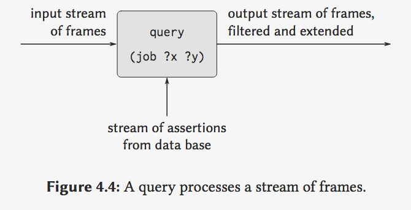
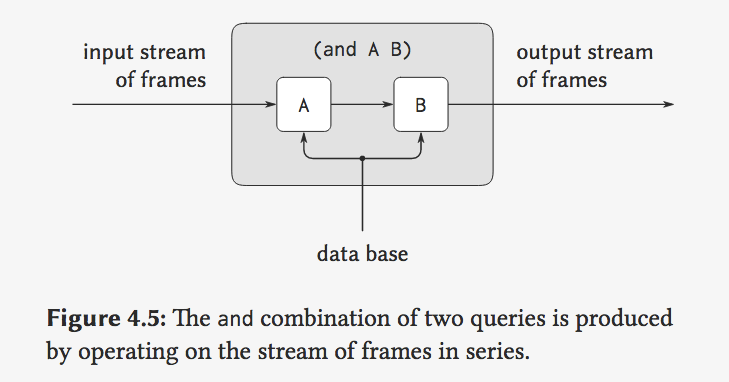
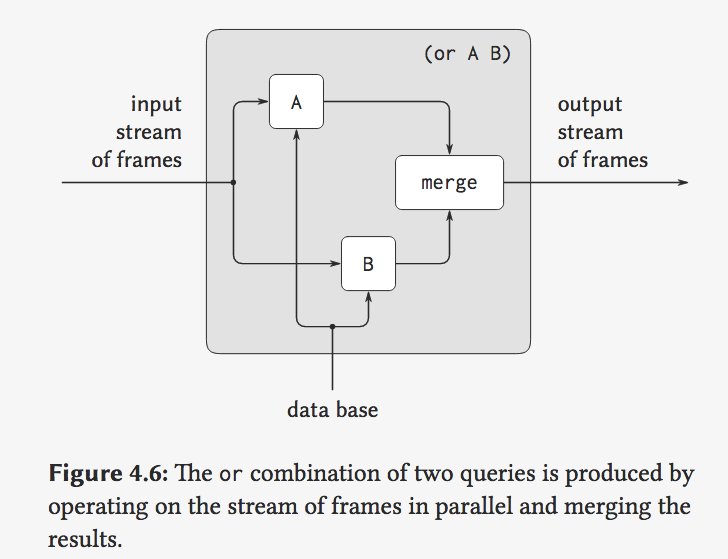

## 8B: Logic Programming, Part 2

Hal Abelson

### Part 1:

All right, well, we've seen how the query language works. Now, let's talk abouthow it's implemented.

At the bottom ofit, there's a pattern matcher.

```lisp
                         ;; Sample Pattern
(a ?x c)
(job ?x (computer ?y)    ;; one element in ?y
(job ?x (computer . ?y)  ;; arbitrary number of elements after in ?y
(a ?x ?x)
(?x ?y ?y ?x)
(a . ?x)
```

Example:

```lisp
(MATCH pat data dictionary)
;; The dictionary is initially empty but can be populated by data provided by the user.

;; Example of input:

pat = (?x ?y ?y ?x)
data = (a b b a)
dict = {x: a}
;; Ouput:
extended dictionary = {x: a, y: b}

If dict = { y: a} => Fail
```


#### Primitive query

```lisp
(job ?x (?D . ?Y))

```



input stream of frames is `previous restrictions`

empty framesays try matching all ways - - query against something inthe database subject to no previous restrictions.

Well, **why** is that so complicated? You probably can think of a lot simpler ways to arrange this match for a primitive query rather than having all of these streams floating around.

The **answer** is this thing extends elegantly to implementthe means of combination.

e.g.:

```lisp
AND can be implement just connect one out-stream to another input stream.
```

#### And query



#### Or query:



#### Not:

From the stream-of-frames viewpoint, the `not` of some query acts as a filter that removes all frames for which the query can be satisfied. 

The major point to notice here, and it's a major point we've looked at before, is this idea of **closure**. The things that we build as a means of combination have the same overall structure asthe primitive things that we're combining.

QA:

1. Where does the dictionary come from?

   > The dictionary comes initially from what you type in. So when you start this up,the first thing it does is set up this whole structure. It puts in one `empty dictionary`. And if all youhave is one primitive query, then what will come out is a bunch of `dictionaries` with things filled in.

2. It appears that the AND performs some redundant searches of the database.

> This one is meant to be--was mainly meant to be very simple so you can see how they fit together.  (老师只是展示了实现方式.)

### Part 2: Rules

 the means of abstraction in this language are rules. 

```lisp
(rule (boss ?z ?d)
      (and (job ?x (?d . ?y))
           (supervisor ?x ?z)))
```

z(person) 是 d (department) 的boss


Well, that's really all there is, except for two technical points: 

1. `(Boss ?who COMPUTER)`

And a **unifier** is a slight generalization of a pattern matcher. What a **unifier** does is take two patterns and say what's the most general thing you can substitute for the variables in those two patterns to make them satisfy the pattern simultaneously? Let me give you an example.

```lisp
unify                 (?x ?x)

with             ((a ?y c) (a b ?z))

                      ?x : (a b c)
                      ?y : b
                      ?z : c
```

or more complicate:

```lisp
unify                 (?x ?x)

with             ((?a a ?w) (b ?v ?z))

                      ?y : b
                      ?v : a
                      ?w : ?z
                      ?x : (b a ?w)
```

A **unifier** is basically a very simple modification of a **pattern matcher**.

And the, quote, deduction that you see is just the fact that there's this recursion, which is unwinding the matches bit by bit.

There are cases where a unifier might have to be clever. Let me show you one more. 

```lisp
unify                 (?x ?x)

with             (?y (a . ?y))

                      ?x : ?y
                      ?y : (a a a ...) ; y is the infinite list of a's
```

 In some sense, in order to do that unification, I have to solve the **fixed-point** equation cons of a to y is equal to y.

```lisp
(cons 'a y) = y
(f y) = y
```

#### No magic!

So how does the logic language handle that? The answer is it doesn't. It just punts. And there's a little check in the unifier, which says, oh, is this one of the hard cases which when I go to match things would involve solving a fixed-point equation?

And in this case, I will **throw up** my hands. And if that check were not in there, what would happen? In most cases is that the unifier would just go into an infinite loop. And other **logic programming** languages work like that. So there's really no magic. The easy case is done in amatcher. The hard case is not done at all. And that's about the state of this technology.


Let me just say again formally how rules work now that I talked about unifiers. So the official definition is that to apply a rule.

```lisp
                     To Apply a Rule
Evaluate the rule body relative to and environment(` what's the dictionary after all? It's a bunch of meanings for symbols. That's what we've been calling frames or environments.`) formed by unifying the rule conclusion wih the given query.

                     To Apply a procedure
Evaludate the procedure body relative to an enviroment formed by binding the procedure parameters to the arguments.
```


Let me just mention one tiny technical problem.

```lisp
(boss ?y computer)
So if I really only did literally what I said, we'd get some variable conflict problems.
```

Notice that problem is exactly a problem we've run into before. It is precisely the need for local variables in a language.

```lisp
Need for Local Variables

(define (square x)
  (* x x))

(define (sum-squares x y)
  (+ (square x) (square y)))
```


QA:

1. I'm wondering if you're arguing that all languages end up coming down to this you can apply a rule or apply a procedure or some kind of apply?

   > And then if you say this part can have parts which I have to unwind, you've got to have something like this cycle.

   > This language again really is different because there's nothing like procedures on the outside.When you go below the surface and you see the implementation, of course, it starts looking thesame.

2. 三四个问题


### Part 3:

We've just seen how the logic language works and how rules work. Now, let's turn to a more profound question.

AND and OR andNOT and the logical implication of rules are not really the AND and OR and NOT and logical implication of logic. Let me give you an example of that.

```lisp
(AND P Q)
(AND Q P)
```


```
(rule (outranked-by ?staff-person ?boss)
      (or (supervisor ?staff-person ?boss)
          (and (supervisor ?staff-person 
                           ?middle-manager)
               (outranked-by ?middle-manager 
                             ?boss))))
```


After answering, the system goes into an **infinite loop**. Explain why.

(这条规则和and的第一条query描述的是同一个问题)

```
(rule (outranked-by ?staff-person ?boss)
  (or (supervisor ?staff-person ?boss)
      (and (outranked-by ?middle-manager
                         ?boss)
           (supervisor ?staff-person 
                       ?middle-manager))))
```


#### order

And there are similar things having to do with the **order** in which you enter rules. The order inwhich it happens to look at rules in the database may vastly change the efficiency with which it gets out answers or,


There's an actual deeper problem when we start comparing, seriously comparing this logicl anguage with real classical logic. So let's sort of review real classical logic.

```lisp
All humans are mortal

All Greeks are human

Socrates is a Greek

;;So: Therefore, Socrates is mortal
```

```lisp
(Greek Socrates) (Greek Plato)
(Greek Zeus) (god Zeus)

; 凡人; 会犯错的
(rule (mortal ?x) (human ?x)) 
(rule (fallible ?x) (human ?x)) ;All humans are fallible

(rule (human ?x)
      (and (Greek ?x) (not (god ?x))))

; the address of any Greek god is Mount Olympus.
(rule (address ?x Olympus)
      (and (Greek ?x) (god ?x)))

(rule (perfect ?x)
      (and (not (mortal ?x)) (not (fallible ?x))))
```

ask for the address of all the perfect beings: 

```lisp
; give us Mout Olympus
(AND (ADDRESS ?x ?y)
     (PERFECT ?x))

; give us Nothing
(AND (PERFECT ?x)
     (ADDRESS ?x ?y))
```

This is not an infinite loop question. This is adifferent answer question.

原因是: NOT isn't generating anything. NOT's only throwing out things.(我们实现NOT的方式).

How to Fix it:

Why are you just doing all your NOT stuff at the beginning? The right way to implementNOT is to realize that when you have conditions like NOT, you should generate all your answersfirst, and then with each of these dictionaries pass along until at the very end I'll do filtering. (最后执行filter)

#### However, there's a more profound problem:

which is which one of these is the right answer? Is itMount Olympus or is it nothing? 

```lisp
(Zeus (NOT mortal)) ; 可以推断出?
```

What NOT needs in this language is not NOT. It's not the NOT of logic. What NOT needs in this language is not deducible from things in the database as opposed to not true.(这个语言中的`Not`不是Logic中的NOT,  而是代表从database中无法推断出.) Subtle but big.

> NOT means not deducible from the things you've told me.

#### closed world assumption:

In aworld where you're identifying not deducible with, in fact, not true, this is called the closed world assumption.

