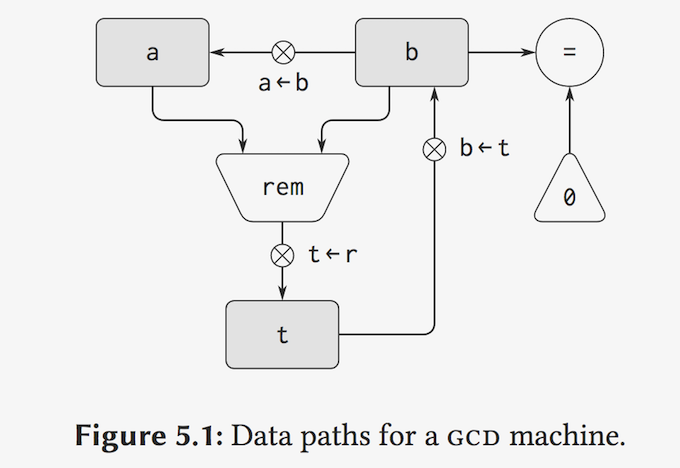
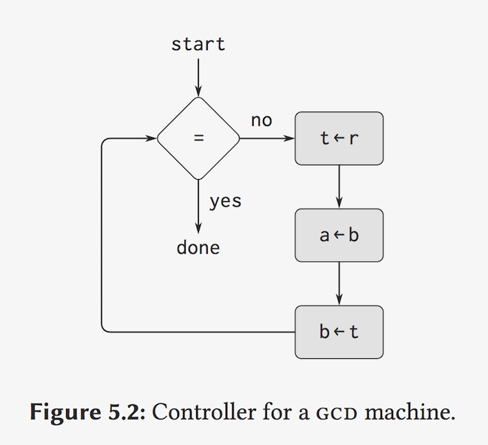
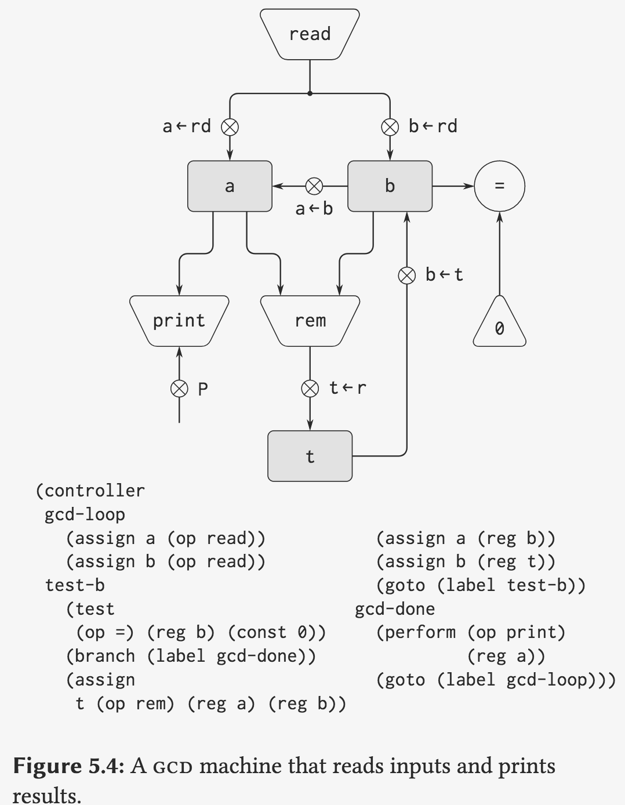
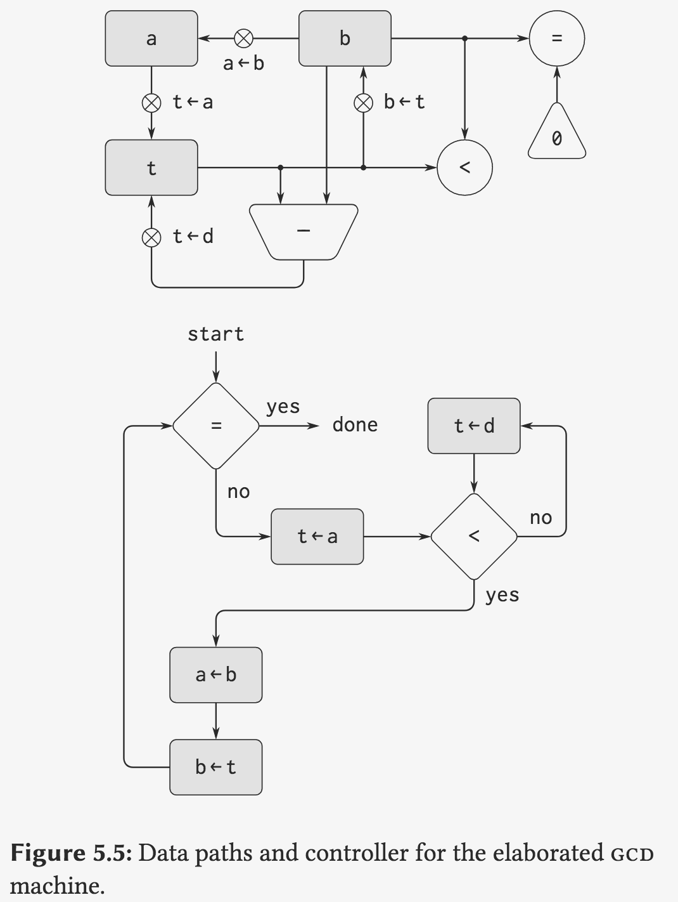
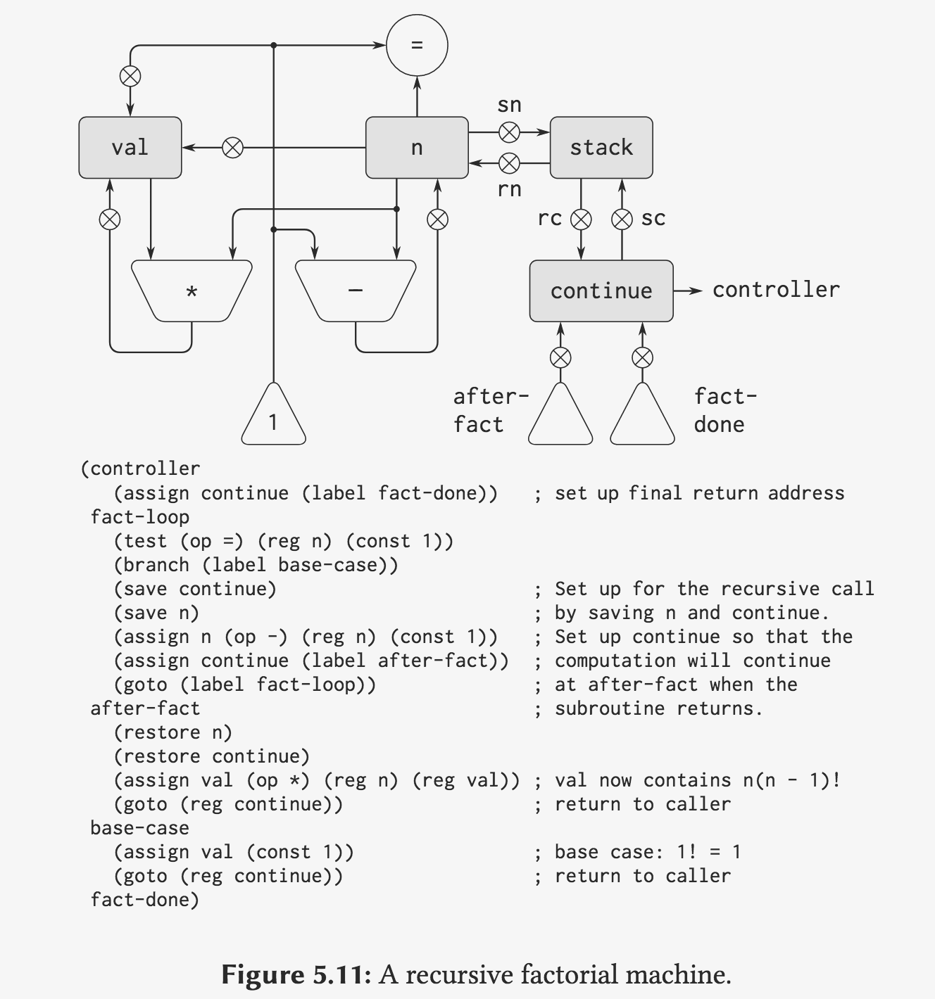

## 9A: Register Machines

Gerald Jay Sussman

### Part 1:

And so what we'd like to do now is diverge from the plan of telling you how to organize bigprograms, and rather tell you something about the mechanisms by which these things can be made to work.


To illustrate the design of a simple register machine, let us examine Euclid’s Algorithm, which is used to compute the greatest common divisor (GCD) of two integers.

```lisp
(define (gcd a b)
  (if (= b 0)
      a
      (gcd b (remainder a b))))
```


One of the important things for designing a computer, which I think most designers don't do, is you study the problem you want to solve and then use what you learn from studying the problem you want to solve to put in the mechanisms needed to solve it in the computer you're building, nomore no less.

#### 1. datapath



#### 2. controller



```lisp
(define-machine GCD
  (resgister a b t)
  (controller
   main (assign a (read))
        (assign b (read))
   loop (branch (zero? (fetch b)) DONE)
        (assign t (ramainder (fetch a) (fetch b))) ;; assign is the name of button
        (assign a (fetch b))
        (assign b (fetcht t))
        (goto loop)
   done (perform (print (fetch a)))
   (gcd main)))
```


#### Run it 

A is 30, B is 42:

Start : T is 30, A is 42, B is 30

T is 12, A is 30, B is 12

T is 6, A is 12, B is 6

T is 0, A is 6 , B is 0 (DONE!)




```lisp
(define remainder n d
  (if (< n d)
      n
      (remainder (- n d) d)))
```




### Part 2:

#### Using a Stack to Implement Recursion

Now you know how to make an iterative procedure, or a procedure that yields an iterative process, turn into a machine.

I suppose the next thing we wantto do is worry about things that reveal recursive processes. So let's play with a simple factorialprocedure.

```lisp
(define (fact n)
  (if (= n 1)
      1
      (* n (fact (- n 1)))))
```

And the way it' sgoing to work is that we're going to store in this place called the **stack** the information required after the inner machine runs to resume the operation of the outer machine.



