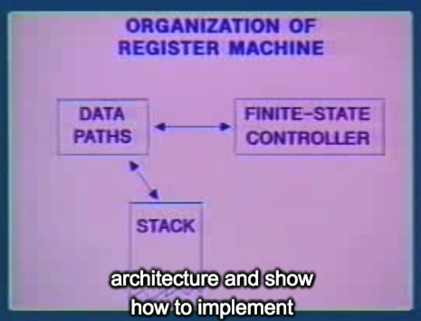
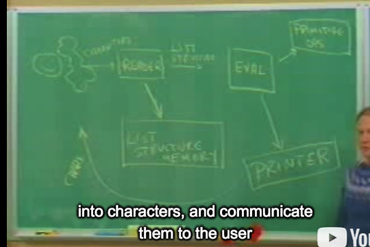

## 9B: Explicit-control Evaluator

### Part 1:

- the magic of building languages, we have looked at:
  -  Escher picture language
  -  digital logic language (数字电路)
  -  query language.

And the thing you should realize is, even though these were toy examples, they really are the kernels of really useful things.

they're all based on LISP. 

#### A lot of people ask what particular problems is LISP good for solving for?

> The answer is LISP is not good for solving any particular problems. What LISP is good for is constructing within it the right language to solve the problems you want to solve, and that's how you should think about it.

 We looked at the meta-circular evaluator and said well, **LISP is based on LISP.**

> `Y operators`, and `fixed points`, and the idea that what this meansis that LISP is somehow the fixed-point equation for this funny set of things which are defined interms of themselves. Now, it's real magic.



So, if we implement LISP in terms of a **register machine**, then everything ought to become, atthis point, completely concrete.

All right, how are we going to do this? We already have all the ingredients.

> all we have to do is take the particular procedures that are the **meta-circular evaluator** and hand-translate them for a register machine.(把Meta-circular evaluator 转换成 register machine, 这样所有lisp都将被translate.)

that's going to be our final most explicit model of LISP in this course:

#### Instance

1. takes space that grows:

```lisp
(define (fact-rec n)
  (if (= n 0)
      1
      (* n (fact-rec (- n 1)))))
```

2.  syntactically recursive, called fact-iter, somehow doesn't take space:

```lisp
(define (fact-iter n)
  (define (iter product counter)
    (if (> counter n)
        product
        (iter (* counter product)
              (+ counter 1))))
  (iter 1 1))
```


 We justify that it doesn't need to take space by showing the substitution model. But we didn't really say how it happens that the machine manages to dothat, that that has to do with the details of how arguments are passed to procedures.



 the reader transforms these into pointers to stuff in this memory, and that's what the evaluator sees

```
      characters           list struct
User ------------> Reader ------------> Evaluator ----------> Printer
 ^                   |                      |                   |
 |                   V                      V                   |
 |             List Structure           Primitive               |
 |                Memory                Operators               |
 |                                                              |
 +--------------------------------------------------------------+
```


####  today, what we're going to talk about is this evaluator.

- The list structure memory, we'll talk about next time.

#### evaluator

```markdown
We will focus on the evaluator, it has 7 registers:

EXP, expression to to be evaluated (pointer to List Structure Memory)
ENV, evaluation environment (pointer to List Structure Memory)

FUN, procedure to be applied
ARGL, list of evaluated argument

(eval/apply loop)

CONTINUE, place to go to next

VAL, result of evaluation

UNEV, temporary register for expressions
```


```lisp
;; Sample evaluator-machine operations

(assign val (fetch exp))

(branch
(conditional? (fetch exp))
 ev-cond)

; first-clause is some selector,
(assign exp (first-clause (fetch exp)))

(assign val
        (lookup-variable-value (fetch exp)
                               (fetch env)))
```


here's a piece of the **meta-circular evaluator**. This is the one using abstract syntax that's in the book. It's a little bit different from the one that Jerry shows you. And the main thing to remember about the evaluator is that it's doing some sort of case analysis on the **kinds of expressions**: so if it's either self-evaluated, or quoted, or whatever else. And then, in the **general case** where the expression it's looking at is an application, there's some tricky recursions going on.

```lisp
(define (eval exp env)
  (cond ((self-evaluating? exp) exp)
        ((variable? exp) (lookup-variable-value exp env))
        ((quoted? exp) (text-of-quotation exp))
        ((assignment? exp) (eval-assignment exp env))
        ((definition? exp) (eval-definition exp env))
        ((if? exp) (eval-if exp env))
        ((lambda? exp)
         (make-procedure (lambda-parameters exp)
                         (lambda-body exp)
                         env))
        ((begin? exp) 
         (eval-sequence (begin-actions exp) env))
        ((cond? exp) (eval (cond->if exp) env))
        ((application? exp)
         (apply (eval (operator exp) env)
                (list-of-values (operands exp) env)))
        (else
         (error "Unknown expression type - EVAL" exp))))
```

#### apply

```lisp
(define (apply procedure arguments)
  (cond ((primitive-procedure? procedure)
         (apply-primitive-procedure procedure arguments))
        ((compound-procedure? procedure)
         (eval-sequence
           ;Compound-apply said we're going to evaluate the body of the procedure in some new environment. (part 3 41:59)
           (procedure-body procedure)
           (extend-environment
             (procedure-parameters procedure)
             arguments
             (procedure-environment procedure))))
        (else
         (error
          "Unknown procedure type - APPLY" procedure))))
```

#### The Eval/Apply cycle

```markdown
                           Eval
    ---------------------------------------------------
    |                                                 |
    |                                                 v
Expression                                        Procedure
Enviroment                                        Arguments
    ^                                                 |
    |                                                 |
    ---------------------------------------------------
                          Apply
```


two big pieces of this evaluator correspond to eval and apply.

Contract that `eval-dispatch` fulfills:

- the `exp` register holds an expression to be evaluated
- the `env` register holds the environment in which the expression is to be evaluated
- the `continue` register holds a place to go next
- the result will be left in the `val` register. Contents of all other registers may be destroyed

Contract that `apply-dispatch` fulfills:

- the `argl` register contains a list of arguments
- the `fun` register contains a procedure to be applied
- the *top of the stack* holds a place to go next
- the result will be left in the `val` register. The stack will be popped. Contents of all other registers may be destroyed.

### Part 2:

#### Real example

```markdown
EXP: 1, x , (+ x y)
ENV: <E0> -> [x=3, y=4]
FUN: 
```


25:54 (两位老师一起演示全过程)

```lisp
; EXP: (+ x y)
EXP: +
ENV: <E0>


UNEV: (X Y)
```


## Evaluator (Partial)

```lisp
eval-dispatch
  (branch (self-evaluating? (fetch exp)) ev-self-eval) ; eg: exp is 1
  (branch (variable? (fetch exp)) ev-variable) ; eg: exp is x
  ; ...

; <... more special forms ...>
  (branch (application? (fetch exp)) ev-application) ; eg: exp is (+ x y)
  (goto unknown-expression-error)

ev-self-eval
  (assign val (fetch exp))
  (goto (fetch continue))

ev-variable
  (assign val (lookup-variable-value (fetch env)))
  (goto (fetch continue))

ev-application
  (assign unev (operands (fetch exp)))
  (assign exp (operator (fetch exp)))  ; replace the expression by the operation to apply
  (save continue)
  (save env)
  (save unev)
  (assign continue eval-args)
  (goto eval-dispatch)                 ; recursive call

eval-args
  (restore unev)
  (restore env)
  (assign fun (fetch val))
  (save fun)
  (assign argl '())
  (goto eval-arg-loop)

eval-arg-loop
  (save argl)
  (assign exp (first-operand (fetch unev)))
  (branch (last-operand? (fetch unev)) eval-last-arg)
  (save env)
  (save unev)
  (assign continue accumulate-arg)
  (goto eval-dispatch)

accumulate-arg
  (restore unev)
  (restore env)
  (restore argl)
  (assign argl (cons val) (fetch argl))
  (assign unev (rest-operands (fetch unev)))
  (goot eval-arg-loop)

eval-last-arg
  (assign continue accumulate-last-arg)
  (goto eval-dispatch)

accumulate-last-arg
  (restore argl)
  (assign argl (cons (fetch val) (fetch argl)))
  (restore fun)
  (goto apply-dispatch)
```

## Applicator

```lisp
apply-dispatch
  (branch (primitive-proc? (fetch fun)) primitive-apply)
  (branch (compound-proc? (fetch fun)) compound-apply)
  (goto unknown-proc-type-error)

primitive-apply
  (assign val (apply-primitive-proc (fetch fun) (fetch argl)))
  (restore continue)
  (goto (fetch continue))

compound-apply
  (assign exp (procedure-body (fetch fun)))
  (assign env (make-bindings (fetch fun) (fetch argl)))
  (restore continue)     ; this is where tail recursion happens
  (goto eval-dispatch)
```


 This whole thing, we used a stack and the evaluator was recursive.

> The reason that you need recursion in the evaluator is because the evaluation process, itself, is recursive, all right? 
>
> It's notbecause the procedure that you might be evaluating in LISP is a recursive procedure.
>
> So that's an important thing that people get confused about a lot.

QA:

2.  Why is it that the order of the arguments in the arg list got reversed?
   - just a convention.


### Part 3:

That's the thing we haven't seen, really. We haven't seen any compound procedures where applying a procedure reduces to evaluating the body of the procedure.

```lisp
(DEFINE (F A B)
        (+ A B))
;;
(F X Y)

E0: [ X=3, y=4, F=procedure, Args: a b , body: + a b]
```

apply-dispatch

## Applicator

```lisp
; apply-dispatch
  (branch (primitive-proc? (fetch fun)) primitive-apply)
  (branch (compound-proc? (fetch fun)) compound-apply)
  (goto unknown-proc-type-error)

; primitive-apply
  (assign val (apply-primitive-proc (fetch fun) (fetch argl)))
  (restore continue)
  (goto (fetch continue))

; compound-apply
  (assign exp (procedure-body (fetch fun)))
  (assign env (make-bindings (fetch fun) (fetch argl)))
  (restore continue)     ; this is where tail recursion happens
  (goto eval-dispatch)
```


#### Reduction (F A B) => (+ A B) in E1

> And, at each point, there'll be no accumulated stuff on the stack because each one's a real reduction

举例对比 an iterative procedure

```lisp
(define (fact-iter n)
  (define (iter product counter)
    (if (> counter n)
        product
        (iter (* counter product)
              (+ counter 1))))
  (iter 1 1))

; no storage needed
(fact-iter 5)
(iter 1 1 5)
(iter 1 2 5)
```

Eg:

```markdown
EXP: (FACT-ITER 5) => (ITER 1 1 N) => (ITER 1 1) => (ITER (* COUNTER PROD) (+ COUNTER 1))
ENV: E1 => E2 [PROD, COUNTER]
```

> Now, you might ask well, is there **build up** (增长) in principle in these environment frames? And the answer is yeah, you have to make these new environment frames, but you don't have to hang onto them when you're done. They can be garbage collected, or the space can be reused automatically.

### Part 4

Let me contrast the iterative procedure just so you'll see where space does build up with a recursive procedure, so you can see the difference.

Let's look at the evaluation of recursive factorial:

```lisp
(define (fact-rec n)
  (if (= n 0)
      1
      (* n (fact-rec (- n 1)))))
;  So, here's fact-recursive, or standard factorial definition. We said this one is still a recursive procedure, but this is actually a recursive process.

(FACT-REC 5)
(* 5 (FACT-REC 4))
(* 5 (* 4 (FACT-REC 3)))
```

. And now, let's actually see that chain of stuff build up and where it is in the machine, OK?

```markdown
EXP: (FACT-REC 5) => (* N (FACT-REC (- N 1)))
ENV: E0, E1 [N = 5]

Evaluation of (* n (fact-rec (- n 1)))

Ready to evaluate operator

EXP: *
ENV: E1
CONTINUE: eval-args

STACK: (n (fact-rec (- n 1)))     <UNEV>
       E1                         <ENV>
       done                       <CONTINUE>
       
       
Ready to evaluate second operand

EXP: (fact-rec (- n 1))
ENV: E1
CONTINUE: accumulate-last-arg

STACK: (5)                 <ARGL>
       <primitive-*>       <FUN>
       done                <CONTINUE>
       
Second call to fact-rec

EXP: (fact-rec n)
ENV: E2 [new N = 4]
CONTINUE: accumulate-last-arg

STACK:   (5)                 <ARGL>
         <primitive-*>       <FUN>
         done                <CONTINUE>
              
Third call to fact-rec

EXP: (fact-rec n)
ENV: E3 [new N = 3]
CONTINUE: accumulate-last-arg

STACK:   (4)                 <ARGL>
         <primitive-*>       <FUN>
         accumulate-last-arg <CONTINUE>
         (5)                 <ARGL>
         <primitive-*>       <FUN>
         done                <CONTINUE>
```

We're about to call eval-dispatch **again**,except we haven't really reduced it because there's stuff **on the stack** now.

So, you see, the **substitution model** is not such a lie. That really is, in some sense, what's sitting right on the stack. OK.

结论:

> Well, the basic reason it's managing to do that is the **evaluator** is set up to `save only what it needs later`.

#### tail recursive

> it's the restore of continue. It's saying when I go off to evaluate the procedure body, I should tell eval to come back to the place where that original evaluation was supposed to come back to.

If I wanted to build a non-tail recursive evaluator, for some strange reason, all I would need to dois, instead of restoring continue at this point, (替换成label: `Where to comeback after you've finished applying the procedure.`, restore意味着提前返回, 因为再次返回这里什么也不用做.)

#### compound apply

```lisp
; compound-apply
  (assign exp (procedure-body (fetch fun)))
  (assign env (make-bindings (fetch fun) (fetch argl)))
  (restore continue)     ; this is where tail recursion happens
  (goto eval-dispatch)
```

> the only difference from the old one is that, instead of going offto eval directly, it takes the whole body of the procedure, which, in this case, is a sequence of expressions, and goes off to eval-sequence.

#### eval-sequence

- And eval-sequence is a little loop that, basically,does these evaluations one at a time. So it does an evaluation. Says oh, when I come back, I'd better come back here to do the next one. 
- And, when I'm all done, when I want to get the last expression, I just restore my continue and go off to eval-dispatch.
- And, again, if you wanted for some reason to **break tail recursion** in this evaluator, all you need to do is not handle the last expression, especially.
- And, for some reason, a lot of LISP evaluators tended to work that way. And the only consequence of that is that iterative procedures built up stack. 
- And it's not clear why that happened.

#### Summarize

- And the main idea is that we have this universal evaluator program, the **meta-circular evaluator**. If we translate that into LISP, then we have all of LISP. And that's all we did.
- The second point is that the magic's gone away. There should be no more magic in this whole system. (In principle, it sould all be very clear except, maybe, for how **list structured memory** works, and we'll see that later. 之后会介绍)
- The third point is that all this **tail recursion** came from the discipline of eval being very careful to save only what it needs next time.

a chip (evaluator) overall structure (1:06:30)

- register array
- data paths
- finite state controller
- external memory, ...

QA:

1. no magic
2. Tail recursion is not going to change the **time complexity** of anything because, in some sense, it's the same algorithm that's going on. What it's doing is really making this thing run as an iteration, right?

